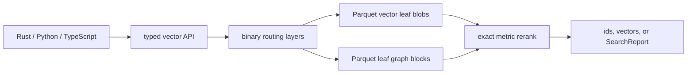

# BORSUK

**Blob-Oriented Retrieval with Segmental Unified KNN**

[](https://github.com/CausalityHQ/borsuk/actions/workflows/ci.yml)
[](https://github.com/CausalityHQ/borsuk/actions/workflows/pages.yml)


BORSUK is a Rust-first similarity-search library for indexes that live mostly
outside RAM. It stores vectors in immutable segment files. By default, small
indexes keep the active manifest and segment summaries resident while
searching. Large object-store readers can open with paged routing
(`resident_routing=false`, `residentRouting: false`, or CLI `--paged-routing`)
so segment summaries and pivots stay out of the resident handle and are resolved
from binary routing pages when needed.



## Why BORSUK Exists

Most ANN libraries assume the index is on local disk or mostly resident in
memory. BORSUK exists for applications where vectors live in Parquet blobs on
local files, S3, MinIO, SeaweedFS, or another S3-compatible object store, while
runtime memory stays bounded and observable. It gives Rust, Python, and
TypeScript callers the same vector-only API, typed metric/mode configuration,
and query reports for latency, bytes read, cache behavior, and resident routing
memory.

## Architecture

BORSUK keeps the implementation contract in the long-form docs under `docs/`:

- Rust core crate: `borsuk`
- native Python API package in `python/`, backed by PyO3/maturin
- native TypeScript/Node API package in `packages/borsuk/`, backed by N-API
- Arrow schema and FFI model with Parquet local-file and object-store storage
- append-only immutable L0 segments, vector-local compacted leaves, segment-local
  graph blocks, and binary manifest/routing/pivot tables with id and
  vector-signature blooms
- out-of-place compaction that can build L1+ read-optimized blobs without
  touching the ingest path, plus explicit obsolete-segment GC
- exact search with segment lower-bound pruning where the metric supports it
- budgeted approximate search with segment, byte, latency, and per-segment
  candidate limits, compressed `pq-scan`/`sq-scan`, and bounded segment-local graph
  traversal
- optional local read-through cache for segment, graph, manifest, and routing
  objects
- search reports for Rust, Python, and TypeScript with segment, byte,
  cache-hit/miss, exact-scoring, and resident-routing-memory counters
- manifest-derived index stats for Rust, Python, and TypeScript covering active
  records, segments, segment/graph bytes, resident metadata, and RAM budget
- broad dense-vector metrics, including Euclidean, cosine, inner product,
  angular, L1/L-infinity, Minkowski, histogram/distribution distances, set-like
  and binary coefficient distances exposed through Rust, Python, and TypeScript
- CI, publish workflow, pre-commit hooks, example, benchmark target, and docs

BORSUK writes immutable segment objects plus compact manifest, routing, pivot,
summary, and graph tables. `CURRENT` is the only non-Parquet persistent object:
it is a fixed binary pointer to the active manifest plus metadata checksums.
Fast writes append L0 segments. Read optimization is explicit: run compaction
after bulk ingest or on your own schedule to rewrite L0 data into vector-local
L1+ leaves. Search then
uses routing summaries, id bloom filters, and vector-signature bloom filters to
fetch only the immutable objects needed for exact scoring, approximate leaf
scans, or graph-backed expansion.
Compaction is incremental by default. Tune `max_segments` for batch size. A
scoped compaction reads only the selected source leaf payloads plus needed
routing metadata, rebuilds graph blocks from those selected records, and leaves
unrelated leaves and old graph payloads unread. When routing pages exist,
compaction publishes the next version page-backed, with no full resident
segment-summary table. `CompactionReport` exposes routing page/index read and
write counters plus old graph payload read counters so this stays measurable.
Use `rebuild` / `borsuk rebuild` for an explicit full source-level rewrite and
optional obsolete-object cleanup.

```text
index-root/
  CURRENT                         binary pointer to active version
  manifests/*.parquet             config, routing_max_level, active object refs
  routing/*.parquet               segment summaries, id/signature blooms, leaf modes
  routing/layers/*/L*/pages.parquet binary routing page indexes
  routing/pages/L*/**/*.parquet   immutable leaf and parent routing pages
  segments/L*/**/*.parquet        ids, vectors, routing_code, pq_code
  graphs/L*/**/*.parquet          segment-local edges
```

For billion-scale indexes, routing is multi-level and computed from leaf count
and routing fanout. The manifest stores the top routing level, parent page refs
store aggregate `leaf_segments`, bytes, records, blooms, centroid/radius
metadata, and persisted per-dimension vector bounds. Paged search walks from
the top routing layer to selected L0 pages, overfetches cheap routing metadata
for recall, and still caps expensive segment/graph payload reads with
`max_segments`. Leaf blobs remain bounded; higher layers are routing pages, not
larger vector blobs. That keeps writes fast, keeps reads near-zero-RAM, and
lets S3 queries drill down to a small number of leaf graph blobs.

Exact search ranks segments with persisted vector bounds when present and falls
back to the centroid/radius lower bound when the metric supports it:

```math
lb(q, s) = max(0, d(q, c_s) - r_s)
```

Approximate search keeps the same global routing step, then caps local work:

```math
C_s = top_m({x in s | distance(sketch(q), sketch(x))})
```

`m` is `max_candidates_per_segment`. The sketch is `routing_code` for
`sq-scan`, `pq_code` for `pq-scan` and `vamana-pq`, and graph-expanded entries
for graph-backed modes. All returned candidates are exact-reranked before ids
or vectors leave the library.

| Mode | Segment read | Graph read | Candidate ranking |
|---|---:|---:|---|
| `flat-scan` | Yes | No | segment order, exact rerank |
| `sq-scan` | Yes | No | scalar `routing_code`, exact rerank |
| `pq-scan` | Yes | No | per-dimension UInt8 `pq_code`, exact rerank |
| `graph` | Yes | Yes | scalar entries + graph traversal, exact rerank |
| `vamana-pq` | Yes | Yes | PQ entries + graph traversal, exact rerank |
| `hybrid` | Yes | Depends | each segment's stored `leaf_mode` |

## Rust Quick Start

```rust
use borsuk::{BorsukIndex, IndexConfig, LeafMode, SearchOptions, VectorMetric};

fn main() -> borsuk::Result<()> {
    let mut index = BorsukIndex::create(IndexConfig {
        uri: "file:///tmp/docs-index".to_string(),
        metric: VectorMetric::Euclidean,
        dimensions: 2,
        segment_max_vectors: 1024,
        ram_budget_bytes: None,
    })?;

    index.add_vectors_with_ids(
        vec![vec![0.0, 0.0], vec![1.0, 0.0]],
        vec!["a".to_string(), "b".to_string()],
    )?;

    let ids = index.search_ids(&[0.1, 0.0], SearchOptions::exact(1))?;
    let vectors = index.search_vectors(&[0.1, 0.0], SearchOptions::exact(1))?;
    let vector = index.get_vector("a")?;
    let approx = index.search_with_report(
        &[0.1, 0.0],
        SearchOptions::approx(1, LeafMode::VamanaPq)
            .with_max_candidates_per_segment(64),
    )?;
    println!("{ids:?} {vectors:?} {vector:?} {:?}", approx.hits);
    Ok(())
}
```

Record ids must be unique. Python and TypeScript `add` calls can omit ids; in
that case BORSUK returns generated ids that skip existing caller-supplied
numeric ids. The storage target is compact arbitrary binary ids with dense
internal numeric row ids. Short numeric/generated ids are preferred because ids
are indexed, bloomed, and returned by search.

## Python Quick Start

```python
from pathlib import Path
from tempfile import TemporaryDirectory

import borsuk

with TemporaryDirectory() as root:
    index = borsuk.create(
        uri=Path(root).as_uri(),
        metric=borsuk.VectorMetricName.EUCLIDEAN,
        dimensions=2,
        segment_max_vectors=1024,
    )

    ids = index.add([[0.0, 0.0], [1.0, 0.0]], ids=["a", "b"])
    nearest_ids = index.search_ids([0.1, 0.0], k=1)
    nearest_vectors = index.search_vectors([0.1, 0.0], k=1)
    vector_a = index.get_vector("a")
    report = index.search_with_report(
        [0.1, 0.0],
        k=1,
        mode=borsuk.SearchMode.APPROX,
        leaf_mode=borsuk.LeafModeName.HYBRID,
        max_candidates_per_segment=64,
    )
    print(ids, nearest_ids, nearest_vectors, vector_a, report.elapsed_ms)
```

## TypeScript Quick Start

```ts
import { mkdtempSync, rmSync } from "node:fs";
import { tmpdir } from "node:os";
import { join } from "node:path";
import { pathToFileURL } from "node:url";

import { LeafModeName, SearchMode, VectorMetricName, create } from "borsuk";

const root = mkdtempSync(join(tmpdir(), "borsuk-"));
try {
  const index = await create({
    uri: pathToFileURL(root).href,
    metric: VectorMetricName.Euclidean,
    dimensions: 2,
    segmentMaxVectors: 1024
  });

  const ids = await index.add([[0, 0], [1, 0]], ["a", "b"]);
  const nearestIds = await index.searchIds([0.1, 0], 1);
  const nearestVectors = await index.searchVectors([0.1, 0], 1);
  const vectorA = await index.getVector("a");
  const report = await index.searchWithReport([0.1, 0], {
    k: 1,
    mode: SearchMode.Approx,
    leafMode: LeafModeName.Hybrid,
    maxCandidatesPerSegment: 64
  });
  console.log(ids, nearestIds, nearestVectors, vectorA, report.elapsedMs);
} finally {
  rmSync(root, { force: true, recursive: true });
}
```

## Full Documentation

- Web docs: <http://causality.pl/borsuk/>
- API reference and examples: [`docs/api.md`](docs/api.md)
- Architecture notes: [`docs/architecture.md`](docs/architecture.md)
- Persistent storage format: [`docs/storage-format.md`](docs/storage-format.md)
- Benchmarks and performance smoke tests: [`docs/benchmarks.md`](docs/benchmarks.md)
- Production readiness gates: [`docs/production-readiness.md`](docs/production-readiness.md)

The hosted docs page also includes interactive architecture and performance
views backed by the checked-in benchmark CSV artifacts under
`docs/web/assets/benchmarks/`.

The benchmark report example emits Markdown tables and CSV files for the web
charts, including lifecycle write/compaction metrics, dataset-size scale
sweeps, query metrics, and parallel pressure metrics:

```bash
cargo run --locked --release -p borsuk --example benchmark_report -- \
  --queries 10 \
  --parallelism 1,2,4,8 \
  --artifacts-dir /tmp/borsuk-bench
```

For dataset-size scaling artifacts, run the same example with a synthetic
record-count sweep:

```bash
cargo run --locked --release -p borsuk --example benchmark_report -- \
  --synthetic-records-list 10000,100000,1000000 \
  --queries 10 \
  --parallelism 1,2,4,8 \
  --artifacts-dir /tmp/borsuk-bench-scale
```

## Examples

- Rust: [`crates/borsuk/examples/local_index.rs`](crates/borsuk/examples/local_index.rs)
- Rust S3-compatible: [`crates/borsuk/examples/s3_index.rs`](crates/borsuk/examples/s3_index.rs)
- Python: [`python/examples/local_index.py`](python/examples/local_index.py)
- Python S3-compatible: [`python/examples/s3_index.py`](python/examples/s3_index.py)
- TypeScript: [`packages/borsuk/examples/local-index.ts`](packages/borsuk/examples/local-index.ts)
- TypeScript S3-compatible: [`packages/borsuk/examples/s3-index.ts`](packages/borsuk/examples/s3-index.ts)
- SeaweedFS S3-compatible: [`examples/seaweedfs`](examples/seaweedfs/README.md)

## Package Support Matrix

CI builds and tests the Python package on Python 3.12, 3.13, and 3.14 across
Linux, Windows, macOS arm64, and macOS Intel runners. The Python package
metadata requires Python 3.12 or newer.

CI builds and tests the TypeScript/Node package on Node 22, 24, and 26 across
Linux, Windows, macOS arm64, and macOS Intel runners. The npm package declares
`node >=22 <27` because these are the maintained Node lines targeted by the
native N-API package.

## Current Status

BORSUK should not be called production-ready until the gates in
[`docs/production-readiness.md`](docs/production-readiness.md) pass on the
release candidate. The current code implements the Phase 0/1 storage and API
target: Arrow schemas, Parquet durable storage, PyO3 Python bindings, and N-API
TypeScript bindings. Local files and S3-compatible object storage use the same
binary Parquet table layout through the Rust `object_store` backend. All
durable index tables except the fixed binary `CURRENT` pointer are Parquet,
including manifests, segment summaries, pivot/routing tables, segment payloads,
and graph blocks. Avro and Protobuf are reserved only for future non-index
append logs or control-plane messages, not vector/index persistence or
Python/TypeScript FFI payloads. Basic query-guided segment-local graph
traversal, scalar and PQ sketch ranking, optional local read-through cache,
resident-memory budget enforcement, and multi-platform Python/TypeScript native
publish workflows are implemented; larger real-dataset evaluation and
production tuning are still active work.

## Object Storage

Use `s3://bucket/prefix` for AWS S3, MinIO, SeaweedFS, and other
S3-compatible stores. Endpoint and credentials are read from standard
object-store/AWS environment variables, for example:

```bash
export AWS_ENDPOINT=http://localhost:8333
export AWS_ALLOW_HTTP=true
export AWS_ACCESS_KEY_ID=minioadmin
export AWS_SECRET_ACCESS_KEY=minioadmin
export AWS_REGION=us-east-1
export AWS_VIRTUAL_HOSTED_STYLE_REQUEST=false
export BORSUK_S3_TEST_URI=s3://borsuk-test/indexes

cargo test --locked -p borsuk s3_compatible_index_round_trip_when_configured \
  --test s3_compatible
```

Set `BORSUK_S3_TEST_URI=s3://bucket/prefix` to the bucket/prefix you want the
smoke test to write into.

With `BORSUK_S3_TEST_URI` and the AWS/object-store environment variables set,
run the Python and TypeScript S3 examples directly:

```bash
cargo run --locked -p borsuk --example s3_index
(cd python && python examples/s3_index.py)
(cd packages/borsuk && npm run example:s3)
```

For a local S3-compatible stack, see
[`examples/seaweedfs`](examples/seaweedfs/README.md). It starts SeaweedFS with
the S3 API enabled and runs the same integration test against
`http://127.0.0.1:8333`.

For blob-backed indexes, pass a local cache directory from Rust, Python, or
TypeScript to keep fetched immutable objects on local NVMe:

```python
idx = borsuk.open(
    "s3://my-bucket/indexes/docs-index",
    cache_dir="/mnt/nvme/borsuk-cache",
    ram_budget="2GB",
)
```

Open always reads `CURRENT` from the backing store, not from cache. For the
active manifest, routing, and pivot metadata tables, the checksums inside
`CURRENT` validate cached bytes; stale or corrupt metadata cache entries are
discarded and refetched automatically. Content-addressed segment, graph, and
routing page objects remain normal read-through cache hits and are still
checked against their persisted references before use.

The CLI is only for administration/debugging, but it can inspect an index
without becoming a runtime bridge:

```bash
borsuk stats --uri file:///tmp/docs-index
borsuk search --uri file:///tmp/docs-index --query '[0.1,0.0]' --report
borsuk search --uri s3://my-bucket/indexes/docs-index --query '[0.1,0.0]' --cache-dir /mnt/nvme/borsuk-cache --report
```

Metric helpers are available without building an index:

```python
borsuk.vector_metric_names()
borsuk.leaf_mode_names()  # ["flat-scan", "sq-scan", "pq-scan", "graph", "vamana-pq", "hybrid"]
borsuk.minkowski_metric(3)
borsuk.vector_distance(borsuk.VectorMetricName.COSINE, [1.0, 0.0], [1.0, 0.0])
borsuk.recall_at_k(["doc-a", "doc-b"], ["doc-b", "doc-x"], 2)
```

## Development

```bash
cargo fmt --all -- --check
cargo clippy --locked --workspace --all-targets -- -D warnings
cargo test --locked --workspace --all-targets
cargo package --locked -p borsuk --allow-dirty
cargo bench --locked --workspace --no-run
(cd python && uvx maturin build --locked --out dist)
wheel="$(ls -t python/dist/borsuk-*.whl | head -1)"
BORSUK_WHEEL_PATH="$wheel" uv run --with "./$wheel" python -m unittest discover python/tests
(cd packages/borsuk && npm ci && npm run build:native && npm test)
```

Install hooks:

```bash
pre-commit install
```

## License

BORSUK is licensed under the Business Source License 1.1 with a revenue-limited
Additional Use Grant: free production use unless your company, organization,
and affiliates make over US $100,000/year. See [LICENSE](LICENSE).
