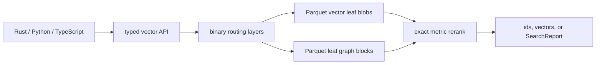

# BORSUK

**Blob-Oriented Retrieval with Segmental Unified KNN**

[](https://github.com/CausalityHQ/borsuk/actions/workflows/ci.yml)
[](https://github.com/CausalityHQ/borsuk/actions/workflows/pages.yml)


BORSUK is a Rust-first similarity-search library for indexes that live mostly
outside RAM. It stores vectors in immutable segment files. By default it opens
with paged routing: segment summaries and pivots stay out of the resident handle
and are resolved from binary routing pages on demand, so resident memory stays
near zero regardless of index size. Small, hot indexes can opt into resident
routing (`resident_routing=true`, `residentRouting: true`, or CLI
`--resident-routing`) to hold all summaries in RAM and skip routing-page reads,
trading memory for lower per-query latency.



## Why BORSUK Exists

Most ANN libraries assume the index is on local disk or mostly resident in
memory. BORSUK exists for applications where vectors live in Parquet blobs on
local files, S3, MinIO, SeaweedFS, or another S3-compatible object store, while
runtime memory stays bounded and observable. It gives Rust, Python, and
TypeScript callers the same vector-only API, typed metric/mode configuration,
and query reports for latency, bytes read, cache behavior, and resident routing
memory.

## ELI5 Intuition

Think of the index as many sealed boxes of vectors, stored on disk or in S3.
RAM keeps a small map, not every vector. At scale that map is not one flat
list; it is several tiny routing layers. A query reads the top map page, walks
down to the few boxes that look relevant, opens only those boxes, and
exact-reranks the candidates it found.

So "map plus boxes" is only the beginner picture. The production shape is a
computed multi-level routing tree: root routing index, parent routing pages
when needed, L0 routing pages, then bounded vector and graph blobs. Users tune
the tree width with `routing_page_fanout` and tune query safety with
`routing_page_overfetch`; BORSUK computes the depth during publish and
compaction from the actual leaf count.
Single-level routing is only the small-index degenerate case of that same
algorithm.

Writes stay fast because new vectors go into fresh L0 boxes. Compaction is like
reorganizing boxes after a delivery rush: it groups nearby vectors into
read-optimized leaves and builds small graph blocks for those leaves. Scoped
compaction should touch only the boxes being reorganized plus the map pages
needed to publish the new layout.

BORSUK is not promising magic perfect recall from a tiny budget. Exact search
can search the full active index. Approximate search is a controlled tradeoff:
the segment payload budget (`max_segments`), routing metadata lookahead
(`routing_page_overfetch`), and local candidate-row budget
(`max_candidates_per_segment`) each spend a different kind of work. Routing
overfetch reads cheap metadata first. It can keep sibling routing pages in play
even when the first dense page already contains enough segment summaries for
the payload budget; `max_segments` still caps expensive segment payloads.
`SearchReport.termination_reason` tells you when a query stopped because of a
budget, so low I/O is visible instead of silently pretending the whole index
was searched.
`SearchReport.recall_guarantee` / `recallGuarantee` classifies the result as
`exact`, `budget-complete`, or `degraded`. Approximate callers can set
`guaranteed_recall=True` / `guaranteedRecall: true` to turn silent recall-loss
budgets into a typed `recall_guarantee_violated` error.

## Fast S3 Operating Mode

The high-scale shape is not a single magic index setting. It is a lifecycle:

1. **Fast writes:** bulk ingest with generated internal ids (`add_vectors`,
   Python/TypeScript `add(vectors)`) so the writer reserves monotonic ids instead
   of scanning old segment payloads for duplicate explicit ids. Keep external ids
   in an application-side map if duplicate validation would dominate ingest.
2. **S3-friendly objects:** use larger ingest leaves, starting with
   `segment_max_vectors=4096` or higher for high-scale object stores, and send
   large application batches. The local scale-attempt harness uses 1,048,576-row
   add batches to avoid thousands of `CURRENT` publishes for 100M rows.
3. **Read-shaped layout:** after bulk ingest, run bounded compaction from L0 to
   L1+ with `target_segment_max_vectors` set to the read leaf size. This groups
   vector-local rows, rebuilds segment-local graph blocks, and publishes routing
   pages without rewriting unrelated leaves.
4. **Paged readers:** paged routing is the default, so large S3 indexes open with
   near-zero resident memory; add a local NVMe `cache_dir` when possible. Readers
   load the top routing index and fetch routing/segment/graph objects on demand.
   Opt into `--resident-routing` only for small, hot indexes that fit in RAM.
5. **Budgeted queries:** tune `max_segments` for payload bytes,
   `routing_page_overfetch` for metadata lookahead, and
   `max_candidates_per_segment` for exact rows scored inside each fetched segment.
   Graph-backed leaf modes read graph objects only when that candidate budget can
   reduce the row set.
6. **S3 proof:** local 100M+ runs validate algorithm shape and object counts, and
   the env-gated `s3_soak` test measures request rate (requests/query and
   requests/add), QPS, p50/p95 read latency, and cache hit ratio against live
   MinIO and SeaweedFS. Every `SearchReport` and `AddReport` carries a `requests`
   breakdown (gets/puts/deletes/heads/lists) so request rate is observable in
   production, not just in the soak. See `examples/minio` and `examples/seaweedfs`.

## Architecture

BORSUK keeps the implementation contract in the long-form docs under `docs/`:

- Rust core crate: `borsuk`
- native Python API package in `python/`, backed by PyO3/maturin
- native TypeScript/Node API package in `packages/borsuk/`, backed by N-API
- Arrow schema and FFI model with Parquet local-file and object-store storage
- append-only immutable L0 segments, vector-local compacted leaves, segment-local
  graph blocks, and binary manifest/routing/pivot tables with id and
  vector-signature blooms
- out-of-place compaction that can build L1+ read-optimized blobs without
  touching the ingest path, plus explicit obsolete-segment GC
- soft record deletion via a cumulative tombstone (bloom resident in the manifest
  so undeleted reads pay nothing); storage reclaimed lazily by compaction or
  synchronously by `purge`
- per-vector schemaless metadata and filtered search (Pinecone-style operator
  dictionary), with segment-level pruning by metadata statistics so selective
  filters read only the segments that can match — the drop-in path for Pinecone,
  turbopuffer, and S3 Vectors
- exact search with segment lower-bound pruning where the metric supports it
- budgeted approximate search with segment, byte, latency, and per-segment
  candidate limits, compressed `pq-scan`/`sq-scan`, and bounded segment-local graph
  traversal
- optional local read-through cache for segment, graph, manifest, and routing
  objects
- search reports for Rust, Python, and TypeScript with segment, byte,
  cache-hit/miss, exact-scoring, and resident-routing-memory counters
- manifest-derived index stats for Rust, Python, and TypeScript covering active
  records, segments, segment/graph bytes, computed routing depth/page counts,
  resident metadata, and RAM budget
- broad dense-vector metrics, including Euclidean, cosine, inner product,
  angular, L1/L-infinity, Minkowski, histogram/distribution distances, set-like
  and binary coefficient distances exposed through Rust, Python, and TypeScript
- CI, publish workflow, pre-commit hooks, example, benchmark target, and docs

BORSUK writes immutable segment objects plus compact manifest, routing, pivot,
summary, and graph tables. `CURRENT` is the only non-Parquet persistent object:
it is a fixed binary pointer to the active manifest plus metadata checksums.
Fast writes append L0 segments. Read optimization is explicit: run compaction
after bulk ingest or on your own schedule to rewrite L0 data into vector-local
L1+ leaves. Search then
uses routing summaries, id bloom filters, and vector-signature bloom filters to
fetch only the immutable objects needed for exact scoring, approximate leaf
scans, or graph-backed expansion.
Compaction is incremental by default. Tune `max_segments` for batch size and
keep `min_segments <= max_segments` when both are set. A scoped compaction reads
only the selected source leaf payloads plus needed routing metadata, rebuilds
graph blocks from those selected records, and leaves unrelated leaves and old
graph payloads unread. When routing pages exist, compaction publishes the next
version page-backed, with no full resident segment-summary table.
`CompactionReport` exposes routing page/index read and write counters, old graph
payload read counters, and new segment+graph payload bytes written so this stays
measurable.
Use `rebuild` / `borsuk rebuild` for an explicit full source-level rewrite and
optional obsolete-object cleanup.

Publishing is optimistic. Versioned routing indexes and manifest/routing/pivot
tables are created conditionally, and `CURRENT` is updated last. Same-version
publish races have one winner; losers surface `BorsukError` with
`code == "concurrent_modification"` in Rust, Python, and TypeScript, refresh the
active pointer, and can retry. If a crash leaves a future version namespace
without advancing `CURRENT`, a fresh writer re-checks the unchanged pointer,
skips that orphaned version, and publishes the next one. Strict cross-version
pointer safety after such a skip depends on a backend with conditional `CURRENT`
updates, such as S3/Azure/GCS ETags; local filesystem multi-process writing is
best-effort only and should use a single writer or external lock in production.

Garbage collection retention is obsolescence-based. An object is reported or
deleted only when it is older than the retention interval (24 hours by default)
and unreferenced by every retained manifest version: `CURRENT`, plus each
superseded version whose replacement is younger than the retention interval.
Objects compacted out of the active manifest therefore stay protected for the
retention interval after they become unreachable, not merely after they were
created. Coverage spans old segment and graph payloads, routing page content,
routing layer indexes, and old or orphaned manifest/routing/pivot tables on
either side of `CURRENT`. Set the retention to zero only when the index is
externally quiesced; concurrent readers may hold a pinned manifest snapshot,
and writers may have staged objects before advancing `CURRENT`.

## Updates and deletes

Deletes are supported and soft. `delete(ids)` — `BorsukIndex::delete` in Rust,
`index.delete(ids)` in Python and TypeScript, or `borsuk delete` — records the
ids in a cumulative tombstone that is filtered out of every search and
`get_vector` immediately. The tombstoned rows are reclaimed lazily by the next
compaction, or on demand with `purge` (`BorsukIndex::purge` / `index.purge()` /
`borsuk purge`), which rewrites the affected segments and clears the tombstone.
Until an id is purged, re-adding it is rejected as a duplicate.

There is no in-place *value* update: a vector's coordinates are never rewritten
under the same id. To change a record, delete it, `purge`, and add the new
value. Background incremental maintenance keeps the layout healthy as you mutate
— oversized segments split and segments left sparse by deletes merge into their
neighbours, and that work is sharded so many nodes can run it in parallel (see
the maintenance APIs in [`docs/api.md`](docs/api.md)).

For a wholesale dataset replacement, rebuild the live records into a fresh index
and let garbage collection remove the superseded objects. `borsuk gc --delete`
is the explicit cleanup command; it only removes objects that no retained
manifest version references, and never decides which logical records should
exist.

```bash
export NEW_URI=file:///tmp/docs-index-v2

borsuk create --uri "$NEW_URI" --metric euclidean --dimensions 2 --segment-max-vectors 1024
borsuk add --uri "$NEW_URI" --input live-records.parquet
borsuk rebuild --uri "$NEW_URI" --source-level 0 --target-level 1 --delete-obsolete
borsuk gc --uri "$NEW_URI" --delete
# Note: gc --delete honors the default 24 h retention window; run immediately
# after rebuild it reclaims nothing yet. Pass --min-age-seconds 0 only when
# the index is externally quiesced (no concurrent readers or writers).
```

```text
index-root/
  CURRENT                         binary pointer to active version
  manifests/*.parquet             config, routing_page_fanout, top routing level
  routing/*.parquet               segment summaries, id/signature blooms, leaf modes
  routing/layers/*/L*/pages.parquet binary routing page indexes
  routing/pages/L*/**/*.parquet   immutable leaf and parent routing pages
  segments/L*/**/*.parquet        ids, vectors, routing_code, pq_code
  graphs/L*/**/*.parquet          segment-local edges
```

For very large indexes, routing is multi-level and computed from leaf count
and the persisted routing page fanout. The manifest stores the fanout and top
routing level, parent page refs store aggregate `leaf_segments`, bytes,
records, blooms, centroid/radius metadata, and persisted per-dimension vector
bounds. Paged search walks from the top routing layer to selected L0 pages,
overfetches cheap routing metadata for recall, and still caps expensive
segment/graph payload reads with
`max_segments`. Leaf blobs remain bounded; higher layers are routing pages, not
larger vector blobs. Single-level routing is only the small-index degenerate
case where the computed leaf count fits one routing level. Once it does not, the
production structure is "map of maps over bounded boxes". That keeps writes
fast, keeps reads near-zero-RAM, and lets S3 queries drill down to a small
number of leaf graph blobs.

Exact search ranks segments with persisted vector bounds when present and falls
back to the centroid/radius lower bound when the metric supports it:

```math
lb(q, s) = max(0, d(q, c_s) - r_s)
```

For metrics without a safe lower bound, such as inner product, approximate
search ranks routing pages and segment summaries by centroid metric distance
only; that rank is not used for exact pruning or epsilon termination.

Approximate search keeps the same global routing step, then caps local work:

```math
C_s = top_m({x in s | distance(sketch(q), sketch(x))})
```

`m` is `max_candidates_per_segment`. The sketch is `routing_code` for
`sq-scan`, `pq_code` for `pq-scan` and `vamana-pq`, and graph-expanded entries
for graph-backed modes. All returned candidates are exact-reranked before ids
or vectors leave the library. Graph-backed modes read graph Parquet only when
the per-segment candidate budget can actually expand beyond the entry rows:
`k < min(max_candidates_per_segment, segment_len) < segment_len`.

| Mode | Status | Segment read | Graph read | Candidate ranking |
|---|---|---:|---:|---|
| `pq-scan` | **Production** | Yes | No | per-dimension UInt8 `pq_code`, exact rerank |
| `sq-scan` | Production | Yes | No | scalar `routing_code`, exact rerank |
| `flat-scan` | Production | Yes | No | segment order, exact rerank |
| `graph` | Experimental | Yes | If budget can expand | scalar entries + graph traversal, exact rerank |
| `vamana-pq` | Experimental | Yes | If budget can expand | PQ entries + graph traversal, exact rerank |
| `hybrid` | Experimental | Yes | Per stored mode and budget | each segment's stored `leaf_mode` |

Use `pq-scan` for production: it is graph-free, compressed, and the lowest and
most predictable on memory. The graph-backed modes (`graph`, `vamana-pq`,
`hybrid`) are experimental — they can lift recall on some datasets but read extra
graph objects and cost more memory, so reach for them only after measuring that
they beat `pq-scan` on your data.

## Rust Quick Start

```rust
use borsuk::{BorsukIndex, IndexConfig, LeafMode, SearchOptions, VectorMetric};

fn main() -> borsuk::Result<()> {
    let mut index = BorsukIndex::create(IndexConfig {
        uri: "file:///tmp/docs-index".to_string(),
        metric: VectorMetric::Euclidean,
        dimensions: 2,
        segment_max_vectors: 1024,
        ram_budget_bytes: None,
    })?;

    index.add_vectors_with_ids(
        vec![vec![0.0, 0.0], vec![1.0, 0.0]],
        vec!["a".to_string(), "b".to_string()],
    )?;

    let ids = index.search_ids(&[0.1, 0.0], SearchOptions::exact(1))?;
    let vectors = index.search_vectors(&[0.1, 0.0], SearchOptions::exact(1))?;
    let vector = index.get_vector("a")?;
    let approx = index.search_with_report(
        &[0.1, 0.0],
        SearchOptions::approx(1, LeafMode::VamanaPq)
            .with_routing_page_overfetch(8)
            .with_max_candidates_per_segment(64),
    )?;
    println!("{ids:?} {vectors:?} {vector:?} {:?}", approx.hits);
    Ok(())
}
```

Record ids must be unique. Python and TypeScript `add` calls can omit ids; in
that case BORSUK returns generated string ids that skip existing
caller-supplied decimal-string ids. Callers can also pass explicit compact
integer ids: Python accepts `int`, and TypeScript accepts `number` or `bigint`.
Those integer ids are encoded as unsigned varint bytes, so smaller ids use fewer
bytes. The storage target is compact arbitrary binary ids with dense internal
numeric row ids. Short ids are preferred because ids are indexed, bloomed, and
returned by search. Report hits expose raw id bytes in Python and TypeScript
(`id_bytes` / `idBytes`) so binary ids do not need UTF-8 decoding.
`search_vectors` / `searchVectors` return vectors from the segment payloads
already loaded and reranked by the query path, without a second id lookup per
hit.

## Python Quick Start

```python
from pathlib import Path
from tempfile import TemporaryDirectory

import borsuk

with TemporaryDirectory() as root:
    index = borsuk.create(
        uri=Path(root).as_uri(),
        metric=borsuk.VectorMetricName.EUCLIDEAN,
        dimensions=2,
        segment_max_vectors=1024,
    )

    ids = index.add([[0.0, 0.0], [1.0, 0.0]], ids=["a", "b"])
    nearest_ids = index.search_ids([0.1, 0.0], k=1)
    nearest_vectors = index.search_vectors([0.1, 0.0], k=1)
    vector_a = index.get_vector("a")
    report = index.search_with_report(
        [0.1, 0.0],
        k=1,
        mode=borsuk.SearchMode.APPROX,
        leaf_mode=borsuk.LeafModeName.HYBRID,
        routing_page_overfetch=8,
        max_candidates_per_segment=64,
    )
    print(ids, nearest_ids, nearest_vectors, vector_a, report.elapsed_ms)
```

## TypeScript Quick Start

```ts
import { mkdtempSync, rmSync } from "node:fs";
import { tmpdir } from "node:os";
import { join } from "node:path";
import { pathToFileURL } from "node:url";

import { LeafModeName, SearchMode, VectorMetricName, create } from "borsuk";

const root = mkdtempSync(join(tmpdir(), "borsuk-"));
try {
  const index = await create({
    uri: pathToFileURL(root).href,
    metric: VectorMetricName.Euclidean,
    dimensions: 2,
    segmentMaxVectors: 1024
  });

  const ids = await index.add([[0, 0], [1, 0]], ["a", "b"]);
  const nearestIds = await index.searchIds([0.1, 0], { k: 1 });
  const nearestVectors = await index.searchVectors([0.1, 0], { k: 1 });
  const vectorA = await index.getVector("a");
  const report = await index.searchWithReport([0.1, 0], {
    k: 1,
    mode: SearchMode.Approx,
    leafMode: LeafModeName.Hybrid,
    routingPageOverfetch: 8,
    maxCandidatesPerSegment: 64
  });
  console.log(ids, nearestIds, nearestVectors, vectorA, report.elapsedMs);
} finally {
  rmSync(root, { force: true, recursive: true });
}
```

## Filtered Search Quick Start

Attach metadata on `add`, then constrain any search with a Pinecone-style
filter. Records are filtered before ranking, and a selective filter skips whole
segments it cannot match. Full operator reference:
[`docs/api.md`](docs/api.md#metadata-and-filtered-search).

```python
index.add(
    [[0.0, 0.0], [1.0, 0.0]],
    ids=["song-1", "song-2"],
    metadata=[{"genre": "rock", "year": 1975}, {"genre": "jazz", "year": 1999}],
)
report = index.search_with_report(
    [0.0, 0.0], k=10,
    filter={"genre": "rock", "year": {"$gte": 1970}},
    include_metadata=True,
)
print(report.hits[0].metadata, report.segments_pruned_by_filter)
```

```ts
await index.add([[0, 0], [1, 0]], {
  ids: ["song-1", "song-2"],
  metadata: [{ genre: "rock", year: 1975 }, { genre: "jazz", year: 1999 }]
});
const report = await index.searchWithReport([0, 0], {
  k: 10,
  filter: { genre: "rock", year: { $gte: 1970 } },
  includeMetadata: true
});
console.log(report.hits[0].metadata, report.segmentsPrunedByFilter);
```

## Drop-in Replacements

Adapters emulate the data-plane surface of Pinecone, turbopuffer, and Amazon S3
Vectors, so existing code switches backend by changing the import and pointing at
a BORSUK storage root. Each namespace (or S3 Vectors index-in-a-bucket) becomes
its own BORSUK index; metadata and filtered search work as they do natively.

```python
# before: from pinecone import Pinecone; pc = Pinecone(api_key="…")
from borsuk.compat.pinecone import Pinecone
pc = Pinecone(base_uri="file:///data/vectors", dimension=768, metric="cosine")

index = pc.Index("products")
index.upsert([("a", embedding, {"genre": "rock"})], namespace="store-1")
index.query(vector=embedding, top_k=10,
            filter={"genre": {"$eq": "rock"}}, include_metadata=True, namespace="store-1")
```

Five adapters ship: Pinecone, Amazon S3 Vectors, and turbopuffer (Python +
TypeScript under `borsuk/compat/{pinecone,s3vectors,turbopuffer}`), plus Chroma
and Qdrant (Python under `borsuk.compat.{chroma,qdrant}`). Full reference,
including the turbopuffer/Qdrant filter translation and honest limits:
[`docs/drop-in.md`](docs/drop-in.md).

## Full Documentation

- Web docs: <http://causality.pl/borsuk/>
- API reference and examples: [`docs/api.md`](docs/api.md)
- Drop-in replacements (Pinecone / turbopuffer / S3 Vectors): [`docs/drop-in.md`](docs/drop-in.md)
- Architecture notes: [`docs/architecture.md`](docs/architecture.md)
- Persistent storage format: [`docs/storage-format.md`](docs/storage-format.md)
- Benchmarks and performance smoke tests: [`docs/benchmarks.md`](docs/benchmarks.md)
- Production readiness gates: [`docs/production-readiness.md`](docs/production-readiness.md)

The hosted docs page also includes interactive architecture and performance
views backed by the checked-in benchmark CSV artifacts under
`docs/web/assets/benchmarks/`.

## Benchmarks And Performance Evidence

The benchmark report example emits Markdown tables and CSV files for the web
charts, including lifecycle write/compaction metrics, dataset-size scale
sweeps, routing-overfetch sweeps, query metrics, and parallel pressure metrics:

```bash
cargo run --locked --release -p borsuk --example benchmark_report -- \
  --queries 100 \
  --parallelism 1,2,4,8 \
  --artifacts-dir /tmp/borsuk-bench
```

Use the benchmark knobs to measure recall/I/O tradeoffs before changing
defaults or release gates:

```bash
cargo run --locked --release -p borsuk --example benchmark_report -- \
  --synthetic-records 100000 \
  --queries 20 \
  --parallelism 1 \
  --max-segments 32 \
  --max-candidates-per-segment 256
```

For dataset-size scaling artifacts, run the same example with a synthetic
record-count sweep:

```bash
cargo run --locked --release -p borsuk --example benchmark_report -- \
  --synthetic-records-list 10000,100000 \
  --queries 100 \
  --parallelism 1,2,4,8 \
  --artifacts-dir /tmp/borsuk-bench-scale
```

For release-candidate million-vector evidence, run the separate ignored
large-scale gate with an output artifact path:

```bash
BORSUK_LARGE_SCALE_OUTPUT=/tmp/borsuk-bench/large-scale.csv \
cargo test --locked --release -p borsuk --test large_scale \
  million_vector_local_search_scale_gate -- --ignored --nocapture
```

The same million-vector gate runs against an S3-compatible object store to
measure network overhead. Point it at a bucket with `BORSUK_LARGE_SCALE_URI`
(the bundled SeaweedFS stack in `examples/seaweedfs` works locally):

```bash
BORSUK_LARGE_SCALE_URI=s3://your-bucket/large-scale \
BORSUK_LARGE_SCALE_BATCH_RECORDS=65536 \
BORSUK_LARGE_SCALE_OUTPUT=/tmp/borsuk-bench/large-scale-s3.csv \
cargo test --locked --release -p borsuk --test large_scale \
  million_vector_local_search_scale_gate -- --ignored --nocapture
```

On SeaweedFS at one million 16D vectors, queries stayed sub-second with about
40% network overhead and identical `1.000000` recall versus local files
(`pq-scan` 368 ms local vs 515 ms over the network), because each query is a
bounded number of object reads. Ingest and compaction cost about 1.7x more over
the network, and object-by-object garbage collection about 6.5x more.

The checked-in benchmark CSV artifacts include synthetic-uniform,
synthetic-clustered, synthetic-adversarial, sklearn-digits, 10k/100k synthetic
scale sweeps, a 100k routing-overfetch sweep, and the million-vector large-scale
gate. `hundred-million-build.csv` and `hundred-million-read.csv` are the
completed 100M scale evidence. The build inserted 100,000,000 of 100,000,000
requested 16D vectors with 4096-vector segments and 1,048,576-record add batches
in 5,907,443 ms, observing 19.29 GB of temp bytes. The read probe shows
paged-routing reads against the compacted artifact: `pq-scan` found inserted id
`42` in 106 ms with an 8-segment budget and 335 ms with a 32-segment budget,
while graph-backed `hybrid` with a 512-row candidate budget took 2,859 ms
because graph traversal dominated this 16D leaf shape. The
latest large-scale artifact covers
1,000,000 vectors and
reports `1.000000 tie-aware recall@10` and `1.000000 id recall@10` for
`pq-scan`, `vamana-pq`, and `hybrid`, with termination reason, query I/O, graph
I/O, observed RSS peak delta, resident metadata, routing overfetch, ingest,
compaction, and exact-reference timings captured in
[`docs/web/assets/benchmarks/large-scale.csv`](docs/web/assets/benchmarks/large-scale.csv).

## Examples

- Rust: [`crates/borsuk/examples/local_index.rs`](crates/borsuk/examples/local_index.rs)
- Rust S3-compatible: [`crates/borsuk/examples/s3_index.rs`](crates/borsuk/examples/s3_index.rs)
- Python: [`python/examples/local_index.py`](python/examples/local_index.py)
- Python S3-compatible: [`python/examples/s3_index.py`](python/examples/s3_index.py)
- TypeScript: [`packages/borsuk/examples/local-index.ts`](packages/borsuk/examples/local-index.ts)
- TypeScript S3-compatible: [`packages/borsuk/examples/s3-index.ts`](packages/borsuk/examples/s3-index.ts)
- SeaweedFS S3-compatible: [`examples/seaweedfs`](examples/seaweedfs/README.md)

## Package Support Matrix

CI builds and tests the Python package on Python 3.12, 3.13, and 3.14 across
Linux x64, Linux arm64, Windows x64, macOS arm64, and macOS Intel runners. The
Python package metadata requires Python 3.12 or newer.

CI builds and tests the TypeScript/Node package on Node 22, 24, and 26 across
Linux x64, Linux arm64, Windows x64, macOS arm64, and macOS Intel runners. The
npm package declares `node >=22 <27` because these are the maintained Node
lines targeted by the native N-API package.

## Status and Maturity

BORSUK implements the full storage and API surface these docs describe: Arrow
schemas over durable Parquet storage, native PyO3 (Python) and N-API
(TypeScript) bindings, and the same binary Parquet layout on local files and
S3-compatible object storage through the Rust `object_store` backend. Every
durable index table except the fixed binary `CURRENT` pointer is Parquet —
manifests, segment summaries, pivot/routing tables, segment payloads, and graph
blocks. (Avro and Protobuf are reserved for possible future non-index append
logs or control-plane messages, never for vector/index persistence or FFI
payloads.) Soft deletion with `purge`, incremental split/merge maintenance,
budgeted approximate and exact search, scalar and PQ sketch ranking, an optional
local read-through cache, resident-memory budget enforcement, and multi-platform
native publish workflows are all in place.

It is young software. Treat a specific build as production-ready only once the
checks in [`docs/production-readiness.md`](docs/production-readiness.md) pass on
that exact build and its benchmark artifacts are published; that page explains
what each check verifies, including the full platform matrix and real
S3-compatible endpoint smoke tests.

## Object Storage

Use `s3://bucket/prefix` for AWS S3, MinIO, SeaweedFS, and other
S3-compatible stores. Endpoint and credentials are read from standard
object-store/AWS environment variables, for example:

```bash
export AWS_ENDPOINT=http://localhost:8333
export AWS_ALLOW_HTTP=true
export AWS_ACCESS_KEY_ID=minioadmin
export AWS_SECRET_ACCESS_KEY=minioadmin
export AWS_REGION=us-east-1
export AWS_VIRTUAL_HOSTED_STYLE_REQUEST=false
export BORSUK_S3_TEST_URI=s3://borsuk-test/indexes

cargo test --locked -p borsuk s3_compatible_index_round_trip_when_configured \
  --test s3_compatible
```

Set `BORSUK_S3_TEST_URI=s3://bucket/prefix` to the bucket/prefix you want the
smoke test to write into.

BORSUK assumes S3-compatible stores provide read-after-write visibility for new
objects and list behavior suitable for retention-based garbage collection.
Retries are delegated to `object_store`'s built-in cloud defaults; after those
retries are exhausted, BORSUK reports typed storage codes such as
`object_store_retryable`, `object_store_not_found`, and
`object_store_permission_denied`. Unconditional writes above 64 MiB use multipart
upload, while conditional publish writes keep single-request create/update
preconditions. See
[`docs/storage-format.md#s3-assumptions-and-caveats`](docs/storage-format.md#s3-assumptions-and-caveats)
for the full concurrency, retry, multipart, and GC-retention caveats.

With `BORSUK_S3_TEST_URI` and the AWS/object-store environment variables set,
run the Python and TypeScript S3 examples directly:

```bash
cargo run --locked -p borsuk --example s3_index
(cd python && python examples/s3_index.py)
(cd packages/borsuk && npm run example:s3)
```

For a local S3-compatible stack, see
[`examples/seaweedfs`](examples/seaweedfs/README.md). It starts SeaweedFS with
the S3 API enabled and runs the same integration test against
`http://127.0.0.1:8333`.

For blob-backed indexes, pass a local cache directory from Rust, Python, or
TypeScript to keep fetched immutable objects on local NVMe:

```python
idx = borsuk.open(
    "s3://my-bucket/indexes/docs-index",
    cache_dir="/mnt/nvme/borsuk-cache",
    ram_budget="2GB",
)
```

Open always reads `CURRENT` from the backing store, not from cache. For the
active manifest, routing, and pivot metadata tables, the checksums inside
`CURRENT` validate cached bytes; stale or corrupt metadata cache entries are
discarded and refetched automatically. Content-addressed segment, graph, and
routing page objects remain normal read-through cache hits and are still
checked against their persisted references before use; corrupt local copies are
deleted and refetched from backing storage.

The CLI is only for administration/debugging, but it can inspect an index
without becoming a runtime bridge:

```bash
borsuk create --uri file:///tmp/docs-index --metric euclidean --dimensions 2 --routing-page-fanout 128
borsuk stats --uri file:///tmp/docs-index
borsuk search --uri file:///tmp/docs-index --query '[0.1,0.0]' --report
borsuk search --uri s3://my-bucket/indexes/docs-index --query '[0.1,0.0]' --cache-dir /mnt/nvme/borsuk-cache --report
```

Metric helpers are available without building an index:

```python
borsuk.vector_metric_names()
borsuk.leaf_mode_names()  # ["flat-scan", "sq-scan", "pq-scan", "graph", "vamana-pq", "hybrid"]
borsuk.minkowski_metric(3)
borsuk.vector_distance(borsuk.VectorMetricName.COSINE, [1.0, 0.0], [1.0, 0.0])
borsuk.recall_at_k(["doc-a", "doc-b"], ["doc-b", "doc-x"], 2)
borsuk.recall_at_k([b"\x00\x9f", 300], [300, b"\x00\x9f"], 2)
borsuk.tie_aware_recall_at_k([0.0, 0.1], [0.0, 0.1], 2)
```

## Development

```bash
cargo fmt --all -- --check
cargo clippy --locked --workspace --all-targets -- -D warnings
cargo test --locked --workspace --all-targets
cargo package --locked -p borsuk --allow-dirty
cargo bench --locked --workspace --no-run
(cd python && uvx maturin build --locked --out dist)
wheel="$(ls -t python/dist/borsuk-*.whl | head -1)"
BORSUK_WHEEL_PATH="$wheel" uv run --with "./$wheel" python -m unittest discover python/tests
(cd packages/borsuk && npm ci && npm run build:native && npm test)
```

Install hooks:

```bash
pre-commit install
```

## License

BORSUK is licensed under the Business Source License 1.1 with a revenue-limited
Additional Use Grant: free production use unless your company, organization,
and affiliates make over US $100,000/year. See [LICENSE](LICENSE).
