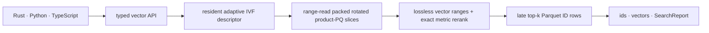

# BORSUK

**Vector search that lives in your bucket.**

*BORSUK — **B**lob-**O**riented **R**etrieval with **S**egmental **U**nified **K**NN.*

[](https://github.com/CausalityHQ/borsuk/actions/workflows/ci.yml)
[](https://github.com/CausalityHQ/borsuk/actions/workflows/pages.yml)


BORSUK keeps your entire vector index as immutable objects — versioned Parquet
tables, checked packed atomic records, and range-addressed Arrow IPC ANN bundles — in
the S3, MinIO, SeaweedFS, GCS, or Azure storage you already pay for. Search runs
inside your
Rust, Python, or TypeScript application process, so there is no separate BORSUK
database cluster. The process still uses real CPU and bounded working memory.
Legacy v7 AWS traces remain in research as historical evidence; v8 rows are
promoted only after fresh source recreation and repetition.

- 🪣 **The index is the bucket or directory.** Routing is Parquet; packed
  quantized-code and typed lossless-vector slices are independent buffers in
  immutable Arrow IPC files. New indexes are graph-free by
  default; experimental graph files are built only when explicitly enabled.
- 🧠 **Bounded across users.** The production default admits four searches and 24 active
  cell reads/decodes per handle. Four CPU workers perform build and query compute;
  24 process-wide small-stack I/O waiters overlap object-store latency without
  increasing scoring CPU. Dimension-aware physical segments target about 16 MiB
  of decoded float32 vectors (64–131,072 rows), selected product codes are read
  in at most 32 MiB/query waves after adaptive IVF routing, and the four-query
  default therefore retains at most 128 MiB of code payload.
- 🎯 **Recall/latency curves, not one magic number.** Historical v7 curves remain
  explicitly labelled while v8 indexes are recreated. Higher recall is
  purchased with more routed cells/candidates, bytes, requests, and latency;
  unmatched-recall comparisons are rejected.
- 🔎 **Metadata + filtered search.** Attach schemaless metadata to any vector and
  filter with a Pinecone-style operator dictionary; selective filters skip whole
  segments they can't match.
- 🔤 **Compact and named vectors, full-text & hybrid search.** Mostly-zero
  vectors can be supplied sparsely and stored sparsely, while vector search still
  sees the same dense value. Optional named vectors, BM25 text search, and hybrid
  fusion use the same bounded object-storage engine.
- 💸 **No invented per-vector fee.** BORSUK adds object storage, requests, and
  optional cache disk to the application compute every option already needs.
  Managed databases put search compute behind their API instead; the
  [cost model](docs/research/cost-and-deployment.md) keeps that boundary explicit.
- 📊 **Everything is measured.** Every query returns a report of bytes read, cache
  behavior, resident memory, and why it stopped.


```mermaid
flowchart LR
  app["Rust · Python · TypeScript"] --> api["typed vector API"]
  api --> route["resident adaptive IVF descriptor"]
  route --> codes["range-read packed rotated product-PQ slices"]
  codes --> rerank["lossless vector ranges + exact metric rerank"]
  rerank --> ids["late top-k Parquet ID rows"]
  ids --> out["ids · vectors · SearchReport"]
```

> **Where it fits:** BORSUK is in the object-storage-native family alongside
> turbopuffer, Pinecone Serverless, and S3 Vectors. Its adaptive IVF routing,
> immutable publication, and LSM-style maintenance share established
> IVF/SPFresh/SPANN systems lineage rather than claiming a new ANN primitive.
> Its niche is a **bounded working set over durable object storage**. Query data
> remains in the bucket; production keeps serving metadata resident and bounds
> per-query cell-read width, global search admission, and active cell decodes
> across users. Overlapping reads of one immutable cell are single-flight. A
> local NVMe cache removes backing-store GETs on a repeated working set. The
> complete standard-dataset evidence, method matrix, resource graphs, external
> comparisons, and publication analysis are isolated in the
> [research section](docs/research/README.md).

## Contents

[Quick start](#quick-start) · [Filtered search](#filtered-search) ·
[Distance metrics](#distance-metrics) ·
[Sparse, full-text & hybrid](#sparse-storage-full-text--hybrid) ·
[Migration adapters](#migration-adapters) · [Intuition](#eli5-intuition) ·
[Updates & deletes](#updates-and-deletes) ·
[Performance evidence](#performance-evidence) ·
[Documentation](#documentation) · [Object storage](#object-storage) ·
[Durability & SLA](#durability--sla) · [Development](#development)

## Quick start

Three lines: create an index, add vectors, search. That's it.

**Python**

```python
import borsuk

index = borsuk.create(uri="file:///tmp/my-index", metric="cosine", dimensions=768)
index.add(embeddings, ids=["doc-1", "doc-2", "doc-3"])

index.search_ids(query, k=5)                         # pq-scan API default
index.search_ids(query, k=5, mode="approx")         # graph-free rotated product-PQ scan
```

**TypeScript**

```ts
import { create } from "borsuk";

const index = await create({ uri: "file:///tmp/my-index", metric: "cosine", dimensions: 768 });
await index.add(embeddings, ["doc-1", "doc-2", "doc-3"]);

await index.searchIds(query, { k: 5 });                   // pq-scan API default
await index.searchIds(query, { k: 5, mode: "approx" });   // graph-free rotated product-PQ scan
```

**Rust**

```rust
use borsuk::{
    BorsukIndex, IndexConfig, SearchOptions, VectorMetric,
    recommended_segment_max_vectors,
};

let mut index = BorsukIndex::create(IndexConfig {
    uri: "file:///tmp/my-index".into(),
    metric: VectorMetric::Cosine,
    dimensions: 768,
    segment_max_vectors: recommended_segment_max_vectors(768),
    ram_budget_bytes: Some(borsuk::DEFAULT_RAM_BUDGET_BYTES),
    text: false,
    named_vectors: Default::default(),
})?;
index.add_vectors_with_ids(embeddings, vec!["doc-1".into(), "doc-2".into()])?;
let ids = index.search_ids(&query, SearchOptions::exact(5))?;
```

Point `uri` at `s3://bucket/prefix` (AWS S3, MinIO, SeaweedFS, …) and the same
code runs against object storage. Ids are optional — omit them on `add` and you
get generated ids back. Want the vectors too? Use `search_vectors` /
`searchVectors`. Want the full I/O and timing report? `search_with_report`.

## Filtered search

Attach metadata when you add, then filter any search with a Pinecone-style query.
Matches are found *before* ranking, so a selective filter is fast and exact.

```python
index.add(
    embeddings,
    ids=["song-1", "song-2"],
    metadata=[{"genre": "rock", "year": 1975}, {"genre": "jazz", "year": 1999}],
)

index.search_ids(query, k=10, filter={"genre": "rock", "year": {"$gte": 1970}})
# → ['song-1']
```

Full operator reference: [`docs/api.md`](docs/api.md#metadata-and-filtered-search).

## Distance metrics

Pick the metric at create time: `metric="cosine"` (or `"euclidean"`, `"dot"` via
`"inner-product"`, `"minkowski:3"`, …). Over 30 are built in — the Lp family
(`euclidean`, `manhattan`, `chebyshev`, `minkowski:p`, `gower`), angle/dot
(`cosine`, `angular`, `inner-product`, `correlation`), abundance
(`bray-curtis`, `canberra`, …), set/binary (`jaccard`, `dice`, `hamming`, …), and
distribution (`jensen-shannon`, `hellinger`, `kullback-leibler`, …) metrics. Every
one returns a distance, so search always keeps the *k* smallest.

**One tradeoff worth knowing:** exact search prunes — provably skips whole
segments it can't need — only for metrics with a sound geometric lower bound.
That covers the Lp family (which satisfies the triangle inequality) **and cosine
and angular**, the two most common RAG metrics: BORSUK measures their pruning
geometry as Euclidean distance over unit-normalized vectors (on unit vectors
`‖a−b‖² = 2(1−cosine)`, so cosine ranking is monotonic in Euclidean distance),
while still storing your original vectors and returning them unchanged. The
remaining metrics (inner-product, the distribution and set families, …) still
work and approximate latency is similar, but their exact and recall-guaranteed
searches scan every candidate. Full equations and tradeoffs:
[`docs/api.md`](docs/api.md#distance-metrics).

## Sparse storage, full-text & hybrid

Every vector slot is one `dimensions`-wide value. You can provide it densely or
as sorted `(index, value)` pairs; BORSUK densifies it and stores it sparse iff
`nnz * 2 < dimensions` unless a record overrides the encoding. Sparse storage is
not a separate index or search path, so it does not change distances, centroids,
routing, PQ, or result ordering. BM25 text is independent and remains opt-in with
`text=True`; hybrid search fuses vector and text rankings with RRF by default or
a weighted sum when you choose weights.

```python
index = borsuk.create(uri="file:///tmp/docs", metric="cosine", dimensions=3,
                      text=True)
index.add(
    [[0.1, 0.2, 0.3]],
    ids=["doc-1"],
    sparse=[([0, 2], [0.1, 0.3])],
    text=["portable object storage vector search"],
)

ids = index.search_hybrid(
    vectors={"": [0.1, 0.2, 0.3]},
    text="object storage",
    k=5,
)
```

Named vectors are declared at create time and searched by name; each named vector
gets its own sub-index while record ids stay shared:

```python
index = borsuk.create(
    uri="file:///tmp/multimodal",
    metric="cosine",
    dimensions=3,
    named_vectors={"title": {"dimensions": 2, "metric": "cosine"}},
)
index.add(
    [[0.1, 0.2, 0.3]],
    ids=["doc-1"],
    named_vectors=[{"title": [1.0, 0.0]}],
)
index.search_ids([1.0, 0.0], k=5, vector="title")
```

A named vector declared with `kind="sparse"` uses an inverted-index backend
instead — for high-dimensional lexical / SPLADE vectors over huge vocabularies.
Nothing is densified, so a query costs only its non-zeros; add the vector as
`(indices, values)` and query it with `search_sparse_named`. Sparse legs also fuse
into `search_hybrid` alongside dense and BM25 text.

For a runnable tour of every retrieval mode and how to combine them — dense,
upsert, filtering, BM25, sparse lexical, hybrid, a RAG retrieve-then-rerank
pattern, and query cost — see the **cookbook** examples:
[`python/examples/cookbook.py`](python/examples/cookbook.py) and
[`packages/borsuk/examples/cookbook.ts`](packages/borsuk/examples/cookbook.ts).

Full reference: [`docs/api.md`](docs/api.md#sparse-vectors-and-full-text-bm25)
and [`docs/api.md`](docs/api.md#named-vectors).

## Migration adapters

The adapters preserve common upsert, query, and filter shapes to reduce migration
work. They are not unconditional behavioral drop-ins: control-plane APIs,
consistency, filtering dialects, and error behavior differ. Each namespace (or
collection, or S3 index) becomes its own BORSUK index.

```python
# before: from pinecone import Pinecone; pc = Pinecone(api_key="…")
from borsuk.compat.pinecone import Pinecone
pc = Pinecone(base_uri="file:///data/vectors", dimension=768, metric="cosine")

index = pc.Index("products")
index.upsert([("a", embedding, {"genre": "rock"})], namespace="store-1")
index.query(vector=embedding, top_k=10,
            filter={"genre": {"$eq": "rock"}}, include_metadata=True, namespace="store-1")
```

Five adapters ship: **Pinecone**, **Amazon S3 Vectors**, and **turbopuffer**
(Python + TypeScript under `borsuk/compat/{pinecone,s3vectors,turbopuffer}`), plus
**Chroma** and **Qdrant** (Python under `borsuk.compat.{chroma,qdrant}`). Native
`$`-operator filters pass straight through; turbopuffer and Qdrant filter dialects
are translated, and Qdrant named dense vectors map to BORSUK named vectors. Full
reference and honest limits: [`docs/drop-in.md`](docs/drop-in.md).

## ELI5 Intuition

Think of the index as many sealed boxes of vectors, stored on disk or in S3. RAM
keeps a small *map*, not every vector. A query reads the top of the map, walks
down to the few boxes that look relevant, opens only those, and exact-reranks the
candidates it found.

"Map plus boxes" is the beginner picture. At scale that map is not one flat list;
it is a **computed multi-level routing tree** — a root routing index, parent
routing pages when needed, then L0 routing pages, then bounded vector and graph
blobs. You tune the tree width with `routing_page_fanout` and query safety with
`routing_page_overfetch`; BORSUK computes the depth during publish and compaction
from the actual leaf count.
Single-level routing is only the small-index degenerate case of that same algorithm.

Writes stay fast because new vectors go into fresh L0 boxes. Compaction is the
cleanup after a delivery rush: it groups nearby vectors into read-optimized leaves
and rebuilds small graph blocks. BORSUK does not promise magic recall from a tiny
budget — exact search can cover the whole index, and approximate search is a
controlled tradeoff whose `SearchReport.recall_guarantee` tells you whether the
result was `exact`, `budget-complete`, or `degraded`.

How it actually picks which boxes to read (the lower bound, the provably-safe
stop) is walked through — with a live 3D demo — in the
[web docs](http://causality.pl/borsuk/docs.html#math).

## Updates and deletes

**`upsert` inserts or replaces by id, atomically** — reads immediately see only
the new version and the old one is reclaimed by the next compaction (a previously
deleted id is revived). This is the overwrite semantics every major vector
database exposes; `add` stays insert-only. Under the hood each record carries an
MVCC generation, and the new version plus the suppression of older generations
are pinned by one cell-WAL transaction descriptor and exposed by one commit
marker; named and sparse-named vectors are replaced in lockstep.

```python
index.add([[1.0, 0.0]], ids=["a"])
index.upsert([[0.0, 1.0]], ids=["a"])   # replaces "a" in place
```

Rust ingestion services can use `BorsukIndex::put` directly, or
`GroupCommitWriter` for concurrent callers. That production path uses one
last-write-wins generation per durable group and avoids strict-insert claim
pages; `add` remains the duplicate-rejecting API.

The default write-ahead log is sharded by stable logical cell, with eight
independent lanes per cell by default. A transaction commit marker makes
cross-cell record/tombstone/ID-directory runs atomically visible without
updating `CURRENT`, so unrelated lanes can accept writes concurrently. It makes
`add`/`upsert` durable and immediately searchable without synchronously
building immutable cells. Call `flush()` only before cell-level administration
such as compaction, or when an external workflow requires every committed row
to exist in immutable cell objects:

```python
index.flush()
index.compact()
```

Deletes are soft. `delete(ids)` records the ids in a cumulative **tombstone** that
is filtered out of every search and `get_vector` immediately; the search report
never claims deleted rows. Tombstoned rows are reclaimed lazily by the next
compaction, or on demand with `purge`, which rewrites the affected segments and
clears the tombstone.

For a wholesale dataset replacement, use `rebuild` to rebuild the live records
into a fresh index, then let garbage collection remove the superseded objects.
`borsuk gc --delete` (the garbage-collection cleanup step) only removes objects that no retained
manifest version references. Background incremental maintenance keeps the layout
healthy as you mutate — oversized segments split, sparse ones merge — and that
work is sharded across nodes. Full contract:
[`docs/api.md`](docs/api.md#deletion).

## Performance evidence

Production qualification requires full-corpus recall, explicit cache states,
p50/p95/p99, object requests/bytes, CPU, RSS, disk I/O, and cache footprint:

```bash
cargo run --locked --release -p borsuk --example benchmark_report -- \
  --queries 100 --parallelism 1,2,4,8 --artifacts-dir /tmp/borsuk-bench
```

See the concise [production benchmark contract](docs/benchmarks.md). All deep
evaluations and checked-in artifacts live under
[`docs/research/`](docs/research/README.md), separate from the default guide.

## Documentation

- **Web docs (interactive):** <http://causality.pl/borsuk/>
- **API reference:** [`docs/api.md`](docs/api.md)
- **Migration adapters:** [`docs/drop-in.md`](docs/drop-in.md)
- **Deployment and integrations:** [`docs/deployment-and-integrations.md`](docs/deployment-and-integrations.md)
- **Architecture:** [`docs/architecture.md`](docs/architecture.md)
- **Storage format:** [`docs/storage-format.md`](docs/storage-format.md)
- **Production benchmark contract:** [`docs/benchmarks.md`](docs/benchmarks.md)
- **Research and comparisons:** [`docs/research/README.md`](docs/research/README.md)

Runnable examples live in
[`crates/borsuk/examples`](crates/borsuk/examples),
[`python/examples`](python/examples),
[`packages/borsuk/examples`](packages/borsuk/examples), and a local S3 stack in
[`examples/seaweedfs`](examples/seaweedfs/README.md).

**Building a RAG app?** [`examples/rag`](examples/rag/README.md) is a complete,
one-file retrieval-augmented chatbot over a BORSUK index — ingest your `.md`/`.txt`
files (local or S3), retrieve, and answer with an LLM. It runs offline as a demo
and upgrades to real embeddings with an `OPENAI_API_KEY`.

## Object storage

Use `s3://bucket/prefix` for AWS S3, MinIO, SeaweedFS, and other S3-compatible
stores; endpoint and credentials come from standard object-store/AWS environment
variables. Pass a local `cache_dir` (NVMe) to keep fetched immutable objects hot:

```python
idx = borsuk.open(
    "s3://my-bucket/indexes/docs-index",
    cache_dir="/mnt/nvme/borsuk-cache",
    ram_budget="2GB",
)
```

`CURRENT` (the one small binary pointer to the active version) is always read
from the backing store; content-addressed objects are cached read-through and
checksum-validated. Full concurrency, retry, multipart, and GC-retention caveats
are in [`docs/storage-format.md`](docs/storage-format.md#s3-assumptions-and-caveats).

## Durability & SLA

BORSUK is a **library, not a hosted service** — it keeps no data of its own
outside your object store and runs no always-on tier. So the index's durability
and availability are, by construction, exactly the **SLA of the bucket you point
it at**; there is no separate BORSUK SLA to reconcile. On **Amazon S3 Standard**
that is AWS's published 99.999999999% (eleven nines) of designed durability and a
99.9% availability service commitment (designed for 99.99%); **GCS Standard** and
**Azure Blob** document their own comparable figures. What BORSUK adds on top is
the *correctness* contract — atomic publication, snapshot-isolated reads,
read-your-writes, and crash-safe recovery — so what the store keeps durable is
always a consistent index, never a half-written one. Details:
[`docs/consistency.md`](docs/consistency.md).

## Packages

CI builds and tests the Python package on Python 3.12, 3.13, and 3.14, and the
TypeScript/Node package on Node 22, 24, and 26. Every build runs across
`Linux x64, Linux arm64, Windows x64, macOS arm64, and macOS Intel`. BORSUK is
young software under active development; pin a specific build and confirm it
against its benchmark artifacts before you depend on it.

## Development

```bash
cargo fmt --all -- --check
cargo clippy --locked --workspace --all-targets -- -D warnings
cargo test --locked --workspace --all-targets
cargo package --locked -p borsuk --allow-dirty
cargo bench --locked --workspace --no-run
(cd python && uvx maturin build --locked --out dist)
wheel="$(ls -t python/dist/borsuk-*.whl | head -1)"
BORSUK_WHEEL_PATH="$wheel" uv run --with "./$wheel" python -m unittest discover python/tests
(cd packages/borsuk && npm ci && npm run build:native && npm test)
```

Format and lint every language before committing:

```bash
cargo fmt --all
uvx ruff check --fix python examples scripts && uvx ruff format python examples scripts
npx prettier@3 --write "packages/borsuk/**/*.ts" "docs/web/*.js" "scripts/*.mjs"
```

Install the git hooks so these run automatically — `pre-commit` formats and lints,
`pre-push` runs Clippy, type checks, and compiles every test target:

```bash
scripts/install-hooks.sh
```

## License

BORSUK is source-available under Business Source License 1.1. The Additional Use
Grant permits production use without a separate software fee when the legal
entity and its affiliates had no more than US $100,000 gross annual revenue in
the most recent fiscal year; larger production users need a commercial license.
The Change Date is 2030-07-02 and the Change License is MIT. Individuals retain
the personal noncommercial, research, development, evaluation, and testing uses
listed in [LICENSE](LICENSE).
