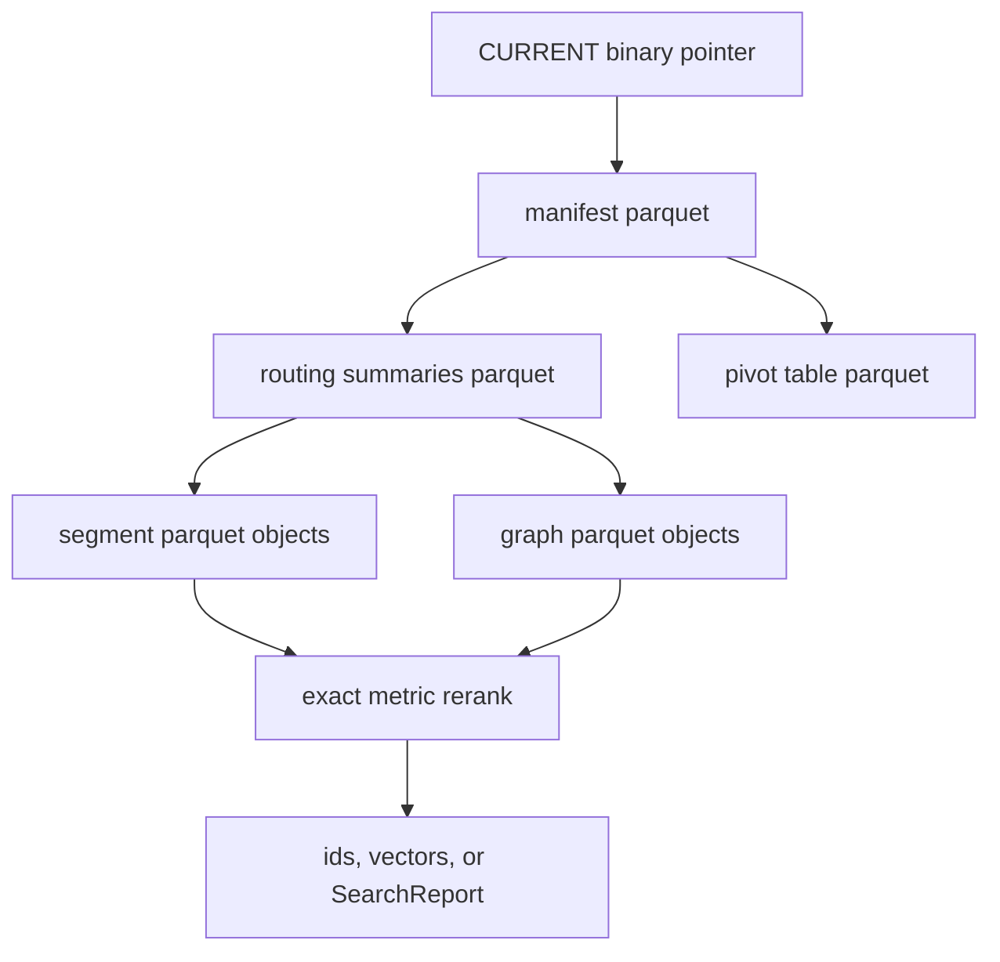
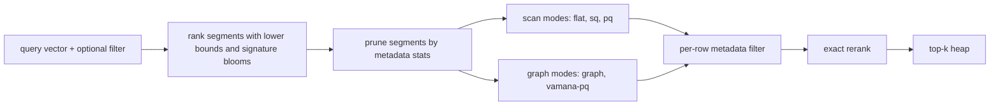

# BORSUK Architecture

BORSUK uses immutable external segments plus routing metadata. Small handles
can keep active segment summaries resident. Large or RAM-budgeted handles can
run page-backed, with a multi-level binary routing tree computed at publish
time and loaded page-by-page during search, `get_vector`, duplicate-id checks,
and compaction.

## Routing Tree Intuition

The right production model is not one flat map followed by boxes of vectors.
That picture is useful only for small indexes where every leaf page fits under
one routing level. At large scale, BORSUK uses a map of maps: the top page
index points to parent routing pages, those pages point to lower routing pages,
and L0 routing pages point to bounded vector and graph blobs.

The tree depth is computed during publish and compaction from active leaf count
and the persisted `routing_page_fanout`. If the fanout is 128, each routing
page groups up to 128 child refs. A few thousand leaves need only shallow
routing. Very large collections need more routing levels so S3 reads can be
pruned before any vector payload is opened.

The decision rule is mechanical, not a manual schema choice: keep leaf vector
blobs bounded, group leaf page refs by fanout, and keep rolling those groups
into parent routing pages until the top index fits. Single-level routing is only
the small-index degenerate case where this process produces only L0 routing page
refs.

This does not put vectors in higher layers. Higher layers contain compact
routing records: bounds, centroids, blooms, byte counters, record counters, and
child page refs. Vector payloads stay in bounded leaf blobs. Search walks the
cheap routing tree first, overfetches metadata pages when recall needs it, then
spends the expensive budget on selected segment and graph payloads.

There are three separate knobs:

- `segment_max_vectors` controls how many vectors normal ingest writes per
  immutable L0 segment.
- `routing_page_fanout` controls routing tree width and depth, and is fixed at
  create time.
- `routing_page_overfetch` controls how many cheap routing metadata candidates
  a query keeps before applying the expensive segment payload budget.

The current implementation keeps these invariants:

- one physical index has one fixed metric;
- durable tables use Arrow schemas and Parquet storage, not Avro, Protobuf, or
  JSON;
- local files and S3-compatible object stores share the same object layout;
- inserted vectors are written to immutable L0 Parquet segment files;
- compaction rewrites selected source-level segments into vector-local
  target-level Parquet leaves and publishes a new manifest without mutating old
  objects;
- garbage collection can dry-run or delete inactive segment objects that are no
  longer referenced by the active manifest;
- `CURRENT` is a tiny binary pointer to the active manifest version and
  per-table checksums for the active manifest/routing/pivot metadata tables;
- manifests and segment summaries are binary Parquet tables, not JSON;
- pivot/router rows are binary Parquet tables loaded with the active manifest;
- the manifest stores a tiny monotonic generated-id counter so add paths that
  omit ids do not scan existing segment payloads;
- segment summaries store fixed-size id and vector-signature bloom filters so
  `get_vector(id)`, explicit duplicate-id checks, and budgeted approximate
  routing can avoid obvious wasted segment reads;
- each segment row stores a small `routing_code` sketch alongside the exact
  vector;
- each active segment summary references a segment-local graph Parquet block
  under `graphs/L*/`;
- search loads one segment at a time and updates a top-k heap;
- exact mode can stop early when a segment lower bound cannot improve the kth
  result.
- approximate mode can stop on segment, byte, latency, epsilon, or
  per-segment candidate budgets.



## Storage Layout

```text
index-root/ or s3://bucket/prefix/
  CURRENT
  manifests/
    manifest-00000000000000000001.parquet
  routing/
    segments-00000000000000000001.parquet
    pivots-00000000000000000001.parquet
  segments/
    L0/
      ab/
        seg-<uuid>.parquet
    L1/
    L2/
  graphs/
    L0/
      cd/
        graph-<uuid>.parquet
    L1/
    L2/
  objects/
```

The segment prefix comes from a stable hash/checksum so object-store backends
can avoid concentrating requests in one path prefix.

The current backend uses full-object `put`, `head`, and byte-range `get`
operations via the Rust `object_store` crate. Full-object reads are implemented
as `head` plus `0..size` range reads so the same primitive can later read
Parquet footers and selected row groups. Every request is tallied at the store
boundary and surfaced as the `requests` breakdown on `SearchReport` and
`AddReport`, so request rate is observable per operation. An optional local
read-through cache can mirror fetched objects under a cache directory while
keeping RAM usage bounded to the active query. `CURRENT` is always read from the
backing store.

BORSUK is single-writer per index. Readers are unbounded and lock-free — they
only fetch immutable, content-addressed objects and the `CURRENT` pointer — but
publish is designed for one writer at a time. New versions are published with a
conditional (compare-and-swap) `CURRENT` update where the backend supports it,
so a losing writer in a race fails rather than corrupting state; this is
best-effort and production deployments should still serialize writes through a
single writer or an external lock.
The active manifest, segment-summary routing, and pivot metadata cache entries
are validated against the checksums stored in fresh `CURRENT`; stale or corrupt metadata cache files are deleted and refetched before open returns. Immutable
content-addressed segment, graph, and routing page objects use normal
read-through caching and are checked against their persisted reference
checksums. A corrupt cached immutable object is deleted and refetched before
decode, while a corrupt backing object still fails checksum validation.
Concurrency limits and retry tuning are separate storage phases.

## Search Flow

1. Load the active manifest.
2. Score segment summaries with a lower bound when the metric supports it.
3. Sort segment candidates by lower bound, or by centroid metric distance when
   the metric does not have a safe lower bound. Budgeted approximate searches
   without epsilon also prioritize segment summaries whose
   `vector_signature_bloom` may contain the quantized query signature before
   routing-rank ties.
4. When the query carries a metadata filter, drop any candidate segment whose
   metadata statistics prove no row can match, before fetching it. For
   equality-class filters, refine this with each candidate's **on-demand filter
   index** — a small exact sidecar object fetched only for filtered queries (never
   resident) — which prunes segments the coarse stats cannot, such as a composite
   filter whose values each pass the bloom but never co-occur in one row.
5. Fetch and decode candidate segments one at a time.
6. In approximate mode, select the rows to rank for each fetched segment. With a
   metadata filter whose match set fits the candidate budget, prefilter: rank the
   segment's exact matching rows (from a per-segment inverted index over
   `Str`/`Bool` metadata, or a row-by-row fallback) instead of ranking
   vector-nearest candidates and discarding non-matches. Otherwise generate a
   bounded candidate set with the requested leaf mode and exact-score at most
   `max_candidates_per_segment` records.
7. Stop before fetching another segment when `max_segments`, `max_bytes`,
   `max_latency_ms`, or an epsilon bound says the approximate budget is spent.
8. Compute exact vector distances for the selected rows, keeping only rows that
   satisfy the metadata filter, and keep scanning until `k` matches or the
   budget is exhausted.
9. Maintain only the current top-k hits in memory.

For metrics where the centroid/radius lower bound is not safe, BORSUK uses the
centroid metric distance only as a budgeted approximate routing rank. It does
not use that centroid distance for exact pruning or epsilon termination.

```math
lb(q, s) = max(0, d(q, c_s) - r_s)
```

`c_s` is the segment centroid, `r_s` is the segment radius, and `d` is the
index metric. The bound is used only where it is safe for the metric.

The current pivot/router table is intentionally small: one pivot row per active
segment, derived from the segment centroid and loaded with the manifest. The
current segment summary also includes fixed-size record-id and vector-signature
bloom filters. The id bloom avoids fetching segments that cannot contain a
requested id during vector lookup or duplicate-id validation. The vector
signature bloom breaks lower-bound ties for budgeted approximate routing before
segment objects are read. Segment summaries also carry a `leaf_mode` field
declaring the local leaf engine for that segment.

When a search carries a metadata filter, the segment summary's **metadata
statistics** — per dotted path numeric min/max and a presence bloom over string
values and value kinds — let BORSUK prove a segment holds no matching row and
skip it before any payload fetch. A selective filter (a single tenant, one genre,
a narrow date range) therefore reads only the few segments that could contain
matches. Negated and existence predicates never prune, since a missing value can
satisfy them. Records that survive to a fetched segment are filtered per row
before ranking, so results are exact, not a post-filter over an unfiltered top-k.

Every segment stores exact vectors plus two compact per-row sketches in
Parquet. `routing_code` is a deterministic scalar code used by `sq-scan` and
graph entry selection. `pq_code` is a per-dimension `UInt8` sketch used by
`pq-scan` and `vamana-pq` for vector-shaped compressed ranking before exact
rerank. BORSUK also writes a segment-local graph block as a Parquet edge table
with local numeric row references, not repeated external string ids.
Small segments build exact local-neighbor graphs. Larger segments build graph
edges from bounded vector-locality and routing-code candidate windows, so write
work scales with record count times a fixed candidate window instead of all pairs in the segment.

Approximate leaf modes differ only in how they choose candidates inside an
already selected segment. Graph-backed modes fetch graph Parquet only when
`k < min(max_candidates_per_segment, segment_len) < segment_len`. Smaller
budgets are already filled by entry rows and cannot add graph neighbors; a
full-segment budget exact-scores every row, so graph I/O would only add latency.

`pq-scan` is the production leaf mode: graph-free, compressed, lowest memory. The
graph-backed modes (`graph`, `vamana-pq`, `hybrid`) are experimental — they can
lift recall on some datasets but read extra graph objects and cost more memory.

| Leaf mode | Status | Segment-local candidate path | Graph reads |
| --- | --- | --- | --- |
| `pq-scan` | Production | Rank rows by `pq_code`, exact-score the best ranked rows. | No |
| `sq-scan` | Production | Rank rows by `routing_code`, exact-score the best ranked rows. | No |
| `flat-scan` | Production | Exact-score rows in segment order until the candidate budget is full. | No |
| `graph` | Experimental | Choose entries by scalar routing, traverse the segment-local graph, exact-score visited records. | If budget can expand |
| `vamana-pq` | Experimental | Choose graph entries by `pq_code`, traverse the segment-local graph, exact-score visited records. | If budget can expand |
| `hybrid` | Experimental | Use each segment's stored `leaf_mode` and report the query as hybrid. | Per stored mode and budget |

L0 insert segments declare `graph`. Compacted L1+ segments declare `vamana-pq`.
Hybrid queries therefore use graph expansion for fresh L0 data and
PQ-seeded graph expansion for compacted data without requiring the caller to
know the segment mix. Because the graph modes are experimental, production
deployments should query with `pq-scan` unless they have measured a graph mode
winning on their data.



## Deletion Flow

Deletes are soft. `BorsukIndex::delete` publishes a new manifest version with a
single cumulative tombstone: a content-addressed object listing the deleted ids,
summarized by an id bloom carried in the manifest table itself. Because the bloom
is already resident, search and `get_vector` reject undeleted ids with no extra
fetch and consult the tombstone object only on a bloom hit. Search drops
tombstoned candidates before top-k selection, so results stay complete over live
records. Segments are never mutated in place: compaction drops tombstoned rows
from the segments it rewrites (lazy reclaim), and `purge` rewrites every active
segment without them and clears the tombstone (synchronous reclaim), after which
the deleted ids can be added again.

## Incremental Maintenance Flow

Beyond level-based compaction, BORSUK rebalances locally, SPFresh/LIRE style, so
maintenance touches only the affected bubbles. `run_incremental_maintenance`
splits a segment that holds too many vectors or whose radius grew too wide into
several tighter bubbles, and merges a segment whose live count fell below a
threshold — typically after deletes — into its nearest neighbour, dropping the
tombstoned rows in the same pass. A fully-deleted bubble collapses to nothing.
Each pass is bounded and republishes reusing every unchanged routing page by
content address, so it is O(touched), not O(index). It is sharded *per segment* —
a bubble is rebalanced only by the node whose rank its id hashes to, and merges
draw their neighbour from the same shard — so every node in a cluster compacts its
own disjoint slice of the bubbles at the same time, no lease required. Each node
publishes its work as a segment delta through a rebase-safe retry loop (re-read
`CURRENT`, re-apply the delta, compare-and-swap), so concurrent publishes compose
instead of clobbering. Search prunes by lower bounds over all candidate bubbles,
so split and merge only need to keep each bubble's centroid and radius honest — a
vector need not live in its strictly nearest partition for correctness.

## Compaction Flow

Inserts append immutable L0 segments. `BorsukIndex::compact` selects active
segments from a source level, reads their Parquet payloads, rewrites the records
into new target-level Parquet segments, and publishes a new manifest version
that references the compacted outputs.

Compaction is the read-optimization boundary. It is deliberately separate from
`add` so writes remain fast and predictable. During compaction, records are
sorted into vector-local order before vector-local leaves are written. This
keeps true neighbors in the same small set of blobs, which improves recall when
queries use strict `max_segments` or byte budgets.

The low-RAM append path follows the same rule: if the active manifest does not
hold segment summaries, `add` writes new L0 segment objects plus new routing
page objects and republishes the page index with existing page refs reused.
Generated ids require no old routing page body reads: append reads the top
routing page index, assigns new L0 leaf ordinals after the existing top-level
span, and writes only the new append branch plus the new top page index.
Repeated small appends decode only the readable rightmost append branch, so the
top index does not grow by one parent per add. If that branch cannot be decoded,
append falls back to a new sparse branch instead of touching unrelated cold
parents. Explicit ids use page-level and segment-level id blooms to narrow
duplicate validation to candidate pages and segments.

Scoped compaction reads only selected source leaf payloads. It does not read
old graph blocks, unrelated target-level leaves, or unselected source leaves.
Graph blocks are rebuilt from the selected records. Leaf routing is published as
a new page-index table that reuses unchanged content-addressed routing page
objects and writes only dirty page objects. Default compaction is bounded by
`DEFAULT_COMPACTION_MAX_SEGMENTS`; callers tune `max_segments` for batch size
or choose the explicit all-matching/full-scope option for offline rebuild work.
A full index rewrite must not be the default `compact` behavior.

For large-scale indexes, publish computes routing layers above the leaves.
The implementation writes leaf-level routing page indexes under
`routing/layers/<version>/L0/pages.parquet`, immutable page objects under
`routing/pages/L0/`, parent indexes under `routing/layers/<version>/L1+`, and
content-addressed parent page objects under `routing/pages/L1+`. Each segment
summary and routing page ref stores centroid/radius plus persisted
per-dimension vector bounds. The bounds are tighter than centroid/radius on
compacted vector-local leaves and are used as the first routing lower bound.
The manifest stores `routing_page_fanout` and `routing_max_level`, so paged
search starts at the top layer, ranks page refs by vector-bound lower bound,
decodes a small overfetch of routing metadata pages to avoid losing recall to
coarse parent boxes or a dense first routing page, and
then enforces the caller's `max_segments` budget only on real segment payload
reads. At each routing layer, overfetch is both a leaf-segment target and a
minimum metadata-page lookahead for tied or close bounds; this keeps sibling
branches eligible for final segment ranking without increasing vector payload
reads. The walk repeats until it reaches selected L0 routing pages. That path
can run when the full
`routing/segments-*.parquet` table is empty, leaving no full resident
segment-summary vector after open. Page-index id blooms let `get_vector(id)`
skip unrelated routing pages before applying segment-level blooms and reading
the target segment payload. Scoped compaction uses the same tree with
`level_mask` to select source leaves whenever routing pages exist, even from a
resident handle. It decodes only routing page objects on the selected branches,
reads only selected source leaf payloads, and rebuilds graph blocks from those
selected records. Unselected source payloads, unrelated target-level leaves,
old graph blocks, and unrelated routing branches stay unread. It then
publishes an empty resident segment-summary table so later operations remain
page-backed. Publishing
replacement compactions rewrites the dirty leaf page objects, the affected
parent page objects, and the new top routing page index when the replacement
summaries fit in the selected leaf pages. If replacement summaries overflow
into additional leaf routing pages, the publish path assigns new leaf ordinals
from the already decoded dirty branches and reserves uncached sibling ranges
without reading them. It then rewrites only the dirty and appended parent
branches plus the top routing page index. It does not reconstruct every leaf
ref, read unrelated append/rightmost branches, or read the global L0 page index
when a parent layer exists. The same top-level page index carries record, byte,
leaf-segment, leaf-page, and routing-page aggregate counters. `IndexStats` uses
those counters for payload and topology totals without materializing segment
summaries or reading segment/graph payload objects. Older page indexes that lack
the page-count counters fall back to walking parent routing metadata for
topology only.

```text
L0 append blobs                 fast writes, no query optimization required
L1 vector-local leaf blobs      bounded vector payloads with leaf-local graphs
R1/R2/R3 routing page indexes   compact binary centroids/sketches/blooms
CURRENT                         points at one consistent manifest/routing set
```

Layer count should be computed from leaf count and routing fanout. RAM budget
affects whether routing is resident or paged, but it should not force larger
leaf vector blobs. Single-level routing is only the small-index degenerate case
when the computed leaf count fits one routing level; large-scale indexes need
multiple routing levels so S3 reads can be pruned before leaf blobs are touched.
Higher layers are routing pages; they do not make leaf vector blobs grow without
bound. A query should read a small number of routing metadata pages, then a
capped number of leaf segment and graph objects. Metadata overfetch is
deliberately cheaper than reading more vector payloads and keeps recall near
exact while preserving the segment-read budget.
This is the implemented hierarchical blob-oriented model. The remaining production-readiness gate is evidence, not architecture: release-candidate artifacts still have to prove recall, write throughput, read latency, and RAM profile at target scale.

The resident summary table is still useful for small and medium indexes and for
compatibility tooling. Large readers should open with paged routing so routing
rows are materialized only from selected page objects.

Old segment objects are deliberately left in place during compaction. They are
no longer active once the new manifest is current, but deletion happens only via
an explicit garbage-collection call so object-store readers do not observe
in-place mutation.

## Garbage Collection Flow

`BorsukIndex::gc_obsolete_segments` lists objects under `segments/` and
`graphs/`, compares them with active segment and graph paths, and treats
unreferenced Parquet objects as candidates. If the active manifest has no
resident segment-summary rows, GC decodes the versioned routing page index and
leaf routing page Parquet metadata to find the active paths. It still avoids
segment payload and graph payload reads. The report exposes routing page-index
reads, routing page reads, metadata bytes read, and cache hit/miss counters so
cleanup I/O stays measurable. Dry-run is the default in public APIs and CLI.
When deletion is explicitly requested, BORSUK deletes only inactive
objects and reports the reclaimed bytes.

Current compaction rebuilds exact vectors, routing codes, graph blocks, and
segment summaries. GC treats inactive segment and graph objects as reclaimable
only after they are no longer referenced by the active manifest.

## ID Model

Public bindings may accept friendly ids, but storage should not treat strings
as the primitive id type. The production model is:

- dense internal numeric row ids for graph edges and row references;
- compact arbitrary external ids stored as binary bytes, not UTF-8-only strings;
- generated ids should be numeric and small by default;
- id lookup should use a binary id index plus segment-level negative filters,
  not a full scan of every leaf.

This keeps long user object keys out of graph edges and hot routing structures
while preserving stable external ids for callers.
