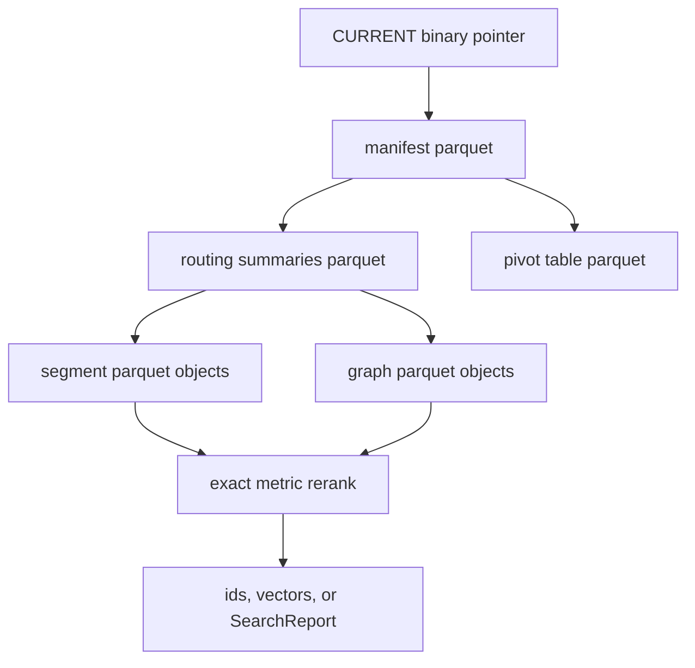
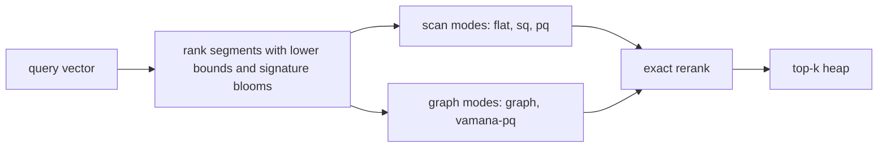

# BORSUK Architecture

BORSUK uses immutable external segments plus routing metadata. Small handles
can keep active segment summaries resident. Large or RAM-budgeted handles can
run page-backed, with a multi-level binary routing tree computed at publish
time and loaded page-by-page during search, `get_vector`, duplicate-id checks,
and compaction.

The current implementation keeps these invariants:

- one physical index has one fixed metric;
- durable tables use Arrow schemas and Parquet storage, not Avro, Protobuf, or
  JSON;
- local files and S3-compatible object stores share the same object layout;
- inserted vectors are written to immutable L0 Parquet segment files;
- compaction rewrites selected source-level segments into vector-local
  target-level Parquet leaves and publishes a new manifest without mutating old
  objects;
- garbage collection can dry-run or delete inactive segment objects that are no
  longer referenced by the active manifest;
- `CURRENT` is a tiny binary pointer to the active manifest version and
  per-table checksums for the active manifest/routing/pivot metadata tables;
- manifests and segment summaries are binary Parquet tables, not JSON;
- pivot/router rows are binary Parquet tables loaded with the active manifest;
- the manifest stores a tiny monotonic generated-id counter so add paths that
  omit ids do not scan existing segment payloads;
- segment summaries store fixed-size id and vector-signature bloom filters so
  `get_vector(id)`, explicit duplicate-id checks, and budgeted approximate
  routing can avoid obvious wasted segment reads;
- each segment row stores a small `routing_code` sketch alongside the exact
  vector;
- each active segment summary references a segment-local graph Parquet block
  under `graphs/L*/`;
- search loads one segment at a time and updates a top-k heap;
- exact mode can stop early when a segment lower bound cannot improve the kth
  result.
- approximate mode can stop on segment, byte, latency, epsilon, or
  per-segment candidate budgets.



## Storage Layout

```text
index-root/ or s3://bucket/prefix/
  CURRENT
  manifests/
    manifest-00000000000000000001.parquet
  routing/
    segments-00000000000000000001.parquet
    pivots-00000000000000000001.parquet
  segments/
    L0/
      ab/
        seg-<uuid>.parquet
    L1/
    L2/
  graphs/
    L0/
      cd/
        graph-<uuid>.parquet
    L1/
    L2/
  objects/
```

The segment prefix comes from a stable hash/checksum so object-store backends
can avoid concentrating requests in one path prefix.

The current backend uses full-object `put`, `head`, and byte-range `get`
operations via the Rust `object_store` crate. Full-object reads are implemented
as `head` plus `0..size` range reads so the same primitive can later read
Parquet footers and selected row groups. An optional local read-through cache
can mirror fetched objects under a cache directory while keeping RAM usage
bounded to the active query. Concurrency limits and retry tuning are separate
storage phases.

## Search Flow

1. Load the active manifest.
2. Score segment summaries with a lower bound when the metric supports it.
3. Sort segment candidates by lower bound. Budgeted approximate searches
   without epsilon also prioritize segment summaries whose
   `vector_signature_bloom` may contain the quantized query signature before
   lower-bound ties.
4. Fetch and decode candidate segments one at a time.
5. In approximate mode, select the requested leaf mode for each fetched
   segment, generate a bounded candidate set, and exact-score at most
   `max_candidates_per_segment` records.
6. Stop before fetching another segment when `max_segments`, `max_bytes`,
   `max_latency_ms`, or an epsilon bound says the approximate budget is spent.
7. Compute exact vector distances for the selected rows.
8. Maintain only the current top-k hits in memory.

For metrics where the centroid/radius lower bound is not safe, BORSUK falls
back to a zero lower bound and performs a segment scan.

```math
lb(q, s) = max(0, d(q, c_s) - r_s)
```

`c_s` is the segment centroid, `r_s` is the segment radius, and `d` is the
index metric. The bound is used only where it is safe for the metric.

The current pivot/router table is intentionally small: one pivot row per active
segment, derived from the segment centroid and loaded with the manifest. The
current segment summary also includes fixed-size record-id and vector-signature
bloom filters. The id bloom avoids fetching segments that cannot contain a
requested id during vector lookup or duplicate-id validation. The vector
signature bloom breaks lower-bound ties for budgeted approximate routing before
segment objects are read. Segment summaries also carry a `leaf_mode` field
declaring the local leaf engine for that segment.

Every segment stores exact vectors plus two compact per-row sketches in
Parquet. `routing_code` is a deterministic scalar code used by `sq-scan` and
graph entry selection. `pq_code` is a per-dimension `UInt8` sketch used by
`pq-scan` and `vamana-pq` for vector-shaped compressed ranking before exact
rerank. BORSUK also writes a segment-local graph block as a Parquet edge table
with local numeric row references, not repeated external string ids.

Approximate leaf modes differ only in how they choose candidates inside an
already selected segment:

| Leaf mode | Segment-local candidate path | Graph reads |
| --- | --- | --- |
| `flat-scan` | Exact-score rows in segment order until the candidate budget is full. | No |
| `sq-scan` | Rank rows by `routing_code`, exact-score the best ranked rows. | No |
| `pq-scan` | Rank rows by `pq_code`, exact-score the best ranked rows. | No |
| `graph` | Choose entries by scalar routing, traverse the segment-local graph, exact-score visited records. | Yes |
| `vamana-pq` | Choose graph entries by `pq_code`, traverse the segment-local graph, exact-score visited records. | Yes |
| `hybrid` | Use each segment's stored `leaf_mode` and report the query as hybrid. | Depends |

L0 insert segments declare `graph`. Compacted L1+ segments declare `vamana-pq`.
Hybrid queries therefore use graph expansion for fresh L0 data and
PQ-seeded graph expansion for compacted data without requiring the caller to
know the segment mix.



## Compaction Flow

Inserts append immutable L0 segments. `BorsukIndex::compact` selects active
segments from a source level, reads their Parquet payloads, rewrites the records
into new target-level Parquet segments, and publishes a new manifest version
that references the compacted outputs.

Compaction is the read-optimization boundary. It is deliberately separate from
`add` so writes remain fast and predictable. During compaction, records are
sorted into vector-local order before vector-local leaves are written. This
keeps true neighbors in the same small set of blobs, which improves recall when
queries use strict `max_segments` or byte budgets.

The low-RAM append path follows the same rule: if the active manifest does not
hold segment summaries, `add` writes new L0 segment objects plus new routing
page objects and republishes the page index with existing page refs reused.
Generated ids require no old-page reads. Explicit ids use page-level and
segment-level id blooms to narrow duplicate validation to candidate pages and
segments.

Scoped compaction reads only selected source leaf payloads. It does not read
old graph blocks, unrelated target-level leaves, or unselected source leaves.
Graph blocks are rebuilt from the selected records. Leaf routing is published as
a new page-index table that reuses unchanged content-addressed routing page
objects and writes only dirty page objects. Default compaction is bounded by
`DEFAULT_COMPACTION_MAX_SEGMENTS`; callers tune `max_segments` for batch size
or choose the explicit all-matching/full-scope option for offline rebuild work.
A full index rewrite must not be the default `compact` behavior.

For billion-scale indexes, publish computes routing layers above the leaves.
The implementation writes leaf-level routing page indexes under
`routing/layers/<version>/L0/pages.parquet`, immutable page objects under
`routing/pages/L0/`, parent indexes under `routing/layers/<version>/L1+`, and
content-addressed parent page objects under `routing/pages/L1+`. Each segment
summary and routing page ref stores centroid/radius plus persisted
per-dimension vector bounds. The bounds are tighter than centroid/radius on
compacted vector-local leaves and are used as the first routing lower bound.
The manifest stores `routing_max_level`, so paged search starts at the top
layer, ranks page refs by vector-bound lower bound, decodes a small overfetch
of routing metadata pages to avoid losing recall to coarse parent boxes, and
then enforces the caller's `max_segments` budget only on real segment payload
reads. The walk repeats until it reaches selected L0 routing pages. That path
can run when the full
`routing/segments-*.parquet` table is empty, leaving no full resident
segment-summary vector after open. Page-index id blooms let `get_vector(id)`
skip unrelated routing pages before applying segment-level blooms and reading
the target segment payload. Scoped compaction uses the same tree with
`level_mask` to select source leaves whenever routing pages exist, even from a
resident handle. It decodes only routing page objects on the selected branches,
reads only selected source leaf payloads, and rebuilds graph blocks from those
selected records. Unselected source payloads, unrelated target-level leaves,
old graph blocks, and unrelated routing branches stay unread. It then
publishes an empty resident segment-summary table so later operations remain
page-backed. Publishing
replacement compactions rewrites the dirty leaf page objects, the affected
parent page objects, and the new top routing page index when the replacement
summaries fit in the selected leaf pages. If replacement summaries overflow
into additional leaf routing pages, the publish path assigns new leaf ordinals
from the already decoded dirty branches and reserves uncached sibling ranges
without reading them. It then rewrites only the dirty and appended parent
branches plus the top routing page index. It does not reconstruct every leaf
ref, read unrelated append/rightmost branches, or read the global L0 page index
when a parent layer exists. The same top-level page index carries record, byte,
and leaf-segment aggregate counters, so `IndexStats`
remains useful without materializing segment summaries or reading payload
objects.

```text
L0 append blobs                 fast writes, no query optimization required
L1 vector-local leaf blobs      bounded vector payloads with leaf-local graphs
R1/R2/R3 routing page indexes   compact binary centroids/sketches/blooms
CURRENT                         points at one consistent manifest/routing set
```

Layer count should be computed from leaf count, routing fanout, and RAM budget,
with explicit overrides for advanced users. Higher layers are routing pages;
they do not make leaf vector blobs grow without bound. A query should read a
small number of routing metadata pages, then a capped number of leaf segment
and graph objects. Metadata overfetch is deliberately cheaper than reading more
vector payloads and keeps recall near exact while preserving the segment-read
budget.
This is the implemented hierarchical blob-oriented model, but it is not the final billion-vector routing design until the production-readiness gates prove
the same recall, write throughput, read latency, and RAM profile at that scale
on release-candidate artifacts.

The resident summary table is still useful for small and medium indexes and for
compatibility tooling. Large readers should open with paged routing so routing
rows are materialized only from selected page objects.

Old segment objects are deliberately left in place during compaction. They are
no longer active once the new manifest is current, but deletion happens only via
an explicit garbage-collection call so object-store readers do not observe
in-place mutation.

## Garbage Collection Flow

`BorsukIndex::gc_obsolete_segments` lists objects under `segments/` and
`graphs/`, compares them with active segment and graph paths, and treats
unreferenced Parquet objects as candidates. If the active manifest has no
resident segment-summary rows, GC decodes the versioned routing page index and
leaf routing page Parquet metadata to find the active paths. It still avoids
segment payload and graph payload reads. Dry-run is the default in public APIs
and CLI. When deletion is explicitly requested, BORSUK deletes only inactive
objects and reports the reclaimed bytes.

Current compaction rebuilds exact vectors, routing codes, graph blocks, and
segment summaries. GC treats inactive segment and graph objects as reclaimable
only after they are no longer referenced by the active manifest.

## ID Model

Public bindings may accept friendly ids, but storage should not treat strings
as the primitive id type. The production model is:

- dense internal numeric row ids for graph edges and row references;
- compact arbitrary external ids stored as binary bytes, not UTF-8-only strings;
- generated ids should be numeric and small by default;
- id lookup should use a binary id index plus segment-level negative filters,
  not a full scan of every leaf.

This keeps long user object keys out of graph edges and hot routing structures
while preserving stable external ids for callers.
