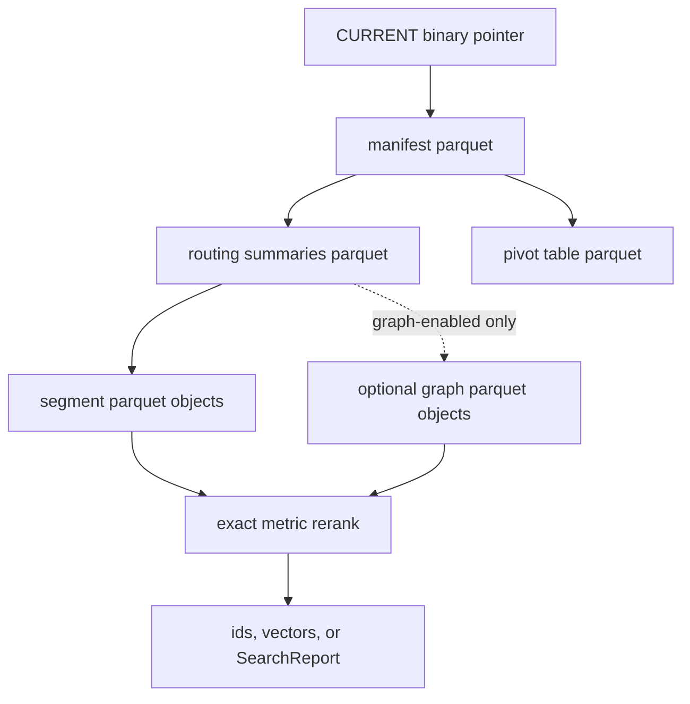
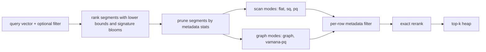

# BORSUK Architecture

BORSUK uses immutable external segments plus routing metadata. Small handles
can keep active segment summaries resident. Large or RAM-budgeted handles can
run page-backed, with a multi-level binary routing tree computed at publish
time and loaded page-by-page during search, `get_vector`, duplicate-id checks,
and compaction.

## Scan codec and cache execution are independent

The build-time scan codec is one of `pq-scan` (classical learned PQ),
`srht-pq-scan` (learned PQ after an SRHT), `fast-turboquant-mse-scan` (the
MSE-only data-oblivious ablation), or `fast-turboquant-scan` (the full two-stage
structured TurboQuant codec). Until the new cross-dataset matrix qualifies a
replacement, the production default is `srht-pq-scan`.

The search-time cache policy is a separate choice. `scan` is the production
default and works against S3 or the local read-through disk cache. The mixed
`auto` target selects graph traversal per checksum-validated local global cell
and the configured scan for uncovered cells, then merges both candidate streams
before exact rerank. Until that cell-local graph path passes recall-matched
cache experiments, the currently implemented graph selection remains an
experimental complete-snapshot control. It falls back to scan rather than
failing when coverage is incomplete.

## Production end-to-end query path

The default graph-free production profile uses one specific path:

1. open and checksum-validate `CURRENT` plus the active manifest;
2. load and checksum-validate the compact global product-code descriptor and
   codebook during startup;
3. route to a corpus-size-aware number of immutable cells, load only those
   product-code chunks, and scan them in parallel with asymmetric-distance tables;
4. keep the configured global candidate budget and group those row locations by
   immutable vector sidecar;
5. range-read the shortlisted lossless float32 rows through a handle-wide
   admission gate; and
6. exact-score those rows with the index metric and maintain top-k.

The currently selected public mode is `srht-pq-scan`; the persisted shortlist
implementation is a seeded structured rotation followed by learned product
quantization. It is graph-free. The codebook, IVF metadata, and chunk
references stay resident.
Product codes remain in bounded object chunks/local disk cache; IDs,
generations, and full-precision vectors come from exact-row sidecar reads.

Code fidelity is selected at build time from measured dimension/scale regimes,
not forced to one width. The current standard-corpus defaults use code64 for
96–128D data, code128 for NYTimes-256, and code256 for GIST-960. GIST's wider
code is an I/O optimization as well as a quality choice: it reduces the
qualified exact shortlist from 608 rows to 96, so only 1.5% more total index
storage buys fewer probes and far fewer lossless rerank reads. Explicit build
settings remain available for publishing matched code-width ablations.

The normal-segment Parquet table has no dense float32 vector column. Exact
vectors remain in the independently range-readable Arrow IPC sidecar.
New cosine/angular indexes build both IVF and shortlist geometry from
unit-normalized copies while keeping the stored exact vectors unchanged.

Production admission is bounded twice: a shared rerank-read gate limits active
sidecar range reads across all callers, and
`OpenOptions::max_active_searches` limits whole queries, while
`max_waiting_searches` bounds the FIFO queue. `leaf_read_width` controls one
query wave and `max_inflight_leaf_reads` caps physical reads across the handle.
This prevents `users × candidates` from becoming the memory or S3 request
limit; excess work fails explicitly with `overloaded`.

Queries that need metadata filtering, include metadata, request exact search, or
force routing-tree behavior use the cell-routed path. An unflushed WAL tail does
not disable a finalized global artifact: the immutable base is searched first
and the bounded live tail is exact-scored and merged by generation. After
flush, only materialized cells not covered by that base use cell routing. A
freshly ingested index uses the cell path until `finish_bulk_load()` or an
explicit full compaction finalizes its global artifact.

## Routing Tree Intuition

The right production model is not one flat map followed by boxes of vectors.
That picture is useful only for small indexes where every leaf page fits under
one routing level. At large scale, BORSUK uses a map of maps: the top page
index points to parent routing pages, those pages point to lower routing pages,
and L0 routing pages point to bounded scan cells plus exact-rerank sidecars.
Graph-enabled research indexes add graph blobs beside those cells.

The tree depth is computed during publish and compaction from active leaf count
and the persisted `routing_page_fanout`. If the fanout is 128, each routing
page groups up to 128 child refs. A few thousand leaves need only shallow
routing. Very large collections need more routing levels so S3 reads can be
pruned before any vector payload is opened.

The decision rule is mechanical, not a manual schema choice: keep leaf vector
blobs bounded, group leaf page refs by fanout, and keep rolling those groups
into parent routing pages until the top index fits. Single-level routing is only
the small-index degenerate case where this process produces only L0 routing page
refs.

This does not put vectors in higher layers. Higher layers contain compact
routing records: bounds, centroids, blooms, byte counters, record counters, and
child page refs. Vector payloads stay in bounded leaf blobs. Search walks the
cheap routing tree first, overfetches metadata pages when recall needs it, then
spends the expensive budget on selected segment payloads and, only for an
explicit graph-enabled method, graph payloads.

There are three separate knobs:

- `segment_max_vectors` controls how many vectors normal ingest writes per
  immutable L0 segment. Binding/CLI defaults derive it from dense vector
  width so a default physical segment holds roughly 16 MiB of float32 vectors
  (clamped to 64–131,072 rows). This keeps routing metadata bounded at 100M
  scale while one cell remains a bounded working set; explicit values remain
  supported.
- `routing_page_fanout` controls routing tree width and depth, and is fixed at
  create time.
- `routing_page_overfetch` controls how many cheap routing metadata candidates
  a query keeps before applying the expensive segment payload budget.

Serving separates admission, per-query wave width, handle-wide physical leaf
reads, process-wide S3 GETs, and CPU execution. Defaults admit eight active and
sixteen waiting searches, issue leaf waves of at most 32, and allow at most 48
in-flight leaf reads per handle. The process CPU pool reserves one core on
small machines and caps itself at four workers; blocking I/O and S3 GETs have
separate configurable ceilings. After immutable ANN bytes arrive, a
collection-local FIFO gate admits at most one inner-parallel approximate head
decode/rank stage into that shared CPU pool by default. This prevents concurrent
queries from fragmenting the pool across many Rayon jobs without serializing S3
downloads; the serial exact-rerank stage remains outside this gate. Fetched bytes
remain charged to transient-memory admission while waiting. Reads of an
identical immutable checksum are
single-flight while they
overlap, so concurrent users share one decode without retaining it as a
resident cache afterward. An explicitly byte-budgeted decoded-segment cache is
still available for a genuinely hot cell set. On graph-enabled indexes, a
decoded and validated immutable graph is attached to that segment's cache entry,
shares its LRU state, and counts against the same byte budget. `warm()` attempts
to prepare both, but does not pin entries past that budget. Its report exposes
the retained segment/graph counts and whether coverage is complete; `Auto` uses
the local graph only for complete coverage and falls back to the storage scan
otherwise. Graph-free indexes allocate neither graph objects nor graph cache
state.

Primary and named modalities share one `CollectionReadRuntime`, rather than
cloning caches and gates per physical child index. Open preflights every
manifest pinned by `collection/CURRENT`, checks their aggregate resident
estimate, then splits the remaining RAM envelope between a nonblocking retained
cache pool and a FIFO transient-decode pool. Collection snapshot references
carry both paged-routing and resident-routing estimates, so open, refresh, and
each compare-and-swap publication enforce the correct aggregate for the serving
mode. Public stats and search reports expose current, capacity, and peak bytes
for both pools. Their collection-resident value sums the manifests actually
loaded by that handle; it can be slightly lower than the conservative persisted
estimate used for admission. Process RSS remains separate because allocators,
thread stacks, clients, and the embedding application are outside this governor.

The current implementation keeps these invariants:

- one physical index has one fixed metric;
- durable objects use the versioned role policy: control, routing, lexical,
  graph, normal-segment, and cell-WAL record tables are Parquet; small atomic
  pointers/heads/markers use checked packed records; and exact dense vectors
  live in standard Arrow IPC sidecars and fixed-width, cell-aligned global
  pages. No index table is a bare JSON object;
- local files and S3-compatible object stores share the same object layout;
- inserted records are appended to immutable transaction-bundled WAL runs
  (default-on) only after an expiring reservation is CAS-published in the
  transaction's root shard. They become atomically visible when one root
  collection commit replaces that reservation in the 64-way sharded
  collection frontier, without a collection-wide `CURRENT` swap. Automatic
  thresholds select complete transaction bundles;
  flush/compaction materializes them into L0 segment files;
- compaction rewrites selected source-level segments into vector-local
  target-level role-policy-selected leaves plus their dense-vector sidecars and
  publishes a new manifest without mutating old objects;
- `finish_bulk_load()` builds the paged global-PQ artifact over the bounded
  ingest segments without rewriting their exact-vector layout; full compaction
  remains an explicit alternative when fewer rerank GETs justify reclustering;
- later writes preserve that immutable base. The manifest identifies its
  covered segment checksums; WAL records are exact-scored as a bounded live
  overlay, flushed cells form a materialized delta, and default compaction
  rewrites only delta cells. Only explicit unbounded/offline compaction replaces
  base-covered segments and trains a new artifact;
- the production benchmark loader caps each dense input checkpoint at 32 MiB
  (`min(1,000,000, floor(32 MiB / (dimensions × 4)))` vectors) and
  locality-orders that checkpoint before cutting segments; GloVe-100 therefore
  uses 83,886-row checkpoints while GIST-960 uses 8,738;
- both finalization paths build the paged global-PQ artifact with a coarse-training
  reservoir capped at 65,536 vectors and 16 MiB (the product codebook samples 4,096),
  one decoded segment, and one 32 MiB interleaved/output chunk pair; they never retain either the
  corpus's full dense matrix or all product codes;
- the coarse topology is metric- and scale-adaptive. Normalized corpora retain
  the measured flat 256-cell router below 5M; larger normalized corpora and
  Euclidean shapes use a 64-way full-dimensional parent plus bounded
  full-dimensional local k-means leaves. Hierarchical construction checks the
  four nearest parents and chooses the best child across them. Queries score
  the leaf centroids directly, preserving cross-coordinate correlations that a
  product-cell router loses. The rejected 2x64 product layout remains an
  explicit research control, not an adaptive default. Compact code/location rows are externally partitioned on
  build scratch disk, so physical ingest checkpoints do not define routing and
  corpus-sized partition buffers never enter RAM;
- one physical ingest segment is encoded in parallel on the four-worker CPU
  pool, then written serially into the external spool. The extra normalized
  vectors and codes are bounded by the dimension-derived segment size rather
  than corpus size;
- selected product-code objects are scored in waves capped by both 32 chunks
  and 32 MiB/query. Combined with four-query production admission, retained
  code payload is capped at 128 MiB process-wide even at 100M vectors;
- cell chunks are record batches in immutable standard Arrow IPC bundles capped
  at 2 MiB of scan payload and 48 MiB total. Code, identity, and mutation rows
  remain cell-contiguous. For the production PQ scan codec, lossless exact rows
  are independently locality-sorted across the bundle and addressed by an
  authenticated `UInt32 exact_ordinal` scan column, so a shortlist spanning
  neighboring cells can share bounded physical range GETs without fetching
  extra candidates. Packed TurboQuant codecs retain deterministic cell order;
  their sign/norm suffixes are not treated as coordinate codes. The fixed-size scan
  and typed exact value buffers remain independently range-addressable, and
  exact vectors are fetched only after MVCC for the bounded rerank shortlist;
- build and query compute are capped at four threads by default
  (`BORSUK_CPU_THREADS` is the explicit process-wide override). Blocking
  object-store waits use a separate process-wide 24-thread small-stack pool
  (`BORSUK_IO_THREADS`) so network fan-out is not accidentally limited to four,
  while the global gates still cap active read/decode buffers. The storage
  runtime does not silently expand compute to every host CPU;
  serving separately caps admitted searches, code reads, sidecar reads, and
  cell decodes;
- garbage collection can dry-run or delete inactive segment objects that are no
  longer referenced by the active manifest;
- `CURRENT` is a tiny binary pointer to the active manifest version and
  per-table checksums for the active manifest/routing/pivot metadata tables;
- manifests and segment summaries are binary Parquet tables, not JSON;
- pivot/router rows are binary Parquet tables loaded with the active manifest;
- the catalog records the generated-id floor while one checked coordination
  counter allocates numeric ranges without scanning segment payloads. Ordinary
  caller-owned nonnumeric ids never read or CAS that collection-wide allocator;
- segment summaries store fixed-size id and vector-signature bloom filters so
  `get_vector(id)`, explicit duplicate-id checks, and budgeted approximate
  routing can avoid obvious wasted segment reads;
- each segment row stores a small `routing_code` scalar sketch plus coarse
  quantization codes; checked segment constants live once in the packed
  row-zero header, and the exact vector lives in the rerank sidecar rather than
  the normal-segment table;
- a pq-scan-only production segment has an empty graph reference; an explicitly
  graph-enabled segment references a graph Parquet block under `graphs/L*/`;
- search pipelines selected cells with bounded per-query width, a handle-wide
  physical-read gate, and a process-wide backing-GET gate, updating a top-k heap
  as results arrive;
- exact mode can stop early when a segment lower bound cannot improve the kth
  result.
- approximate mode can stop on segment, byte, latency, epsilon, or
  per-segment candidate budgets.


```mermaid
flowchart TD
  current["CURRENT binary pointer"] --> manifest["manifest parquet"]
  manifest --> routing["routing summaries parquet"]
  manifest --> pivots["pivot table parquet"]
  routing --> segments["segment parquet objects"]
  routing -. "graph-enabled only" .-> graphs["optional graph parquet objects"]
  segments --> rerank["exact metric rerank"]
  graphs --> rerank
  rerank --> results["ids, vectors, or SearchReport"]
```

## Storage Layout

```text
index-root/ or s3://bucket/prefix/
  CURRENT
  manifests/
    manifest-00000000000000000001.parquet
  routing/
    segments-00000000000000000001.parquet
    pivots-00000000000000000001.parquet
  segments/
    L0/
      ab/
        seg-<checksum>.parquet
    L1/
    L2/
  graphs/                       # absent for pq-scan-only indexes
    L0/
      cd/
        graph-<uuid>.parquet
    L1/
    L2/
  vectors/
    ef/
      <checksum>.arrow        # per-segment dense-vector rerank sidecar
  quantizer/
    01/
      <checksum>.parquet      # persisted IVF coarse quantizer (cold-index routing)
  cells/
    <routing-epoch>/<cell-ordinal>/wal/<lane>/
      HEAD                               # checked packed conditional lane frontier
      frontier/<checksum>.bin            # checked packed immutable linked frontier node
      runs/records/<checksum>.parquet
      runs/tombstones/<checksum>.parquet
      runs/id-directory/<checksum>.bin   # checked packed ownership rows
  transactions/
    <transaction-id>/descriptors/<checksum>.bin # checked packed immutable descriptor
    <transaction-id>/STATE               # checked packed transaction fence
    <transaction-id>/COMMIT              # checked packed atomic visibility marker
  collection/
    wal-frontier/<00..63>/
      HEAD                                # checked packed bounded active collection commits
  id-directory/
    claim-shards/<00..15>/LOCK            # fixed batch insert claims
    generated/NEXT                       # checked packed generated-id counter
  lane-log/
    ACTIVE                                 # versioned JSON active-stripe directory
    lanes/<writer-stripe>/HEAD             # versioned JSON lease/frontier/publication fence
    lanes/<writer-stripe>/epochs/<epoch>/extents/<sequence>.arrow # immutable Arrow IPC mutation table
  objects/
```

The segment prefix comes from a stable hash/checksum so object-store backends
can avoid concentrating requests in one path prefix.

The current backend uses full-object `put`, `head`, and byte-range `get`
operations via the Rust `object_store` crate. Full-object reads are implemented
as `head` plus `0..size` range reads so the same primitive can later read
Parquet footers and selected row groups. Every request is tallied at the store
boundary and surfaced as the `requests` breakdown on `SearchReport` and
`AddReport`, so request rate is observable per operation. An optional local
read-through cache can mirror fetched objects under a cache directory while
keeping RAM usage bounded to the active query. `CURRENT` is always read from the
backing store.

Group-commit drains materialize a collection-wide snapshot, then conditionally
advance every captured writer-stripe checkpoint. This checkpoint changes only
the monotonic durable/materialized frontier and sealed-epoch coverage; it
preserves the live owner, lease epoch, and lease expiry. A live stripe writer
reconciles that checkpoint-only HEAD version change into its next watermark,
renewal, or release, so one client can retire work already published for a peer
without stealing the peer's lease or forcing the peer to rebuild the same
routing layer.

BORSUK supports concurrent durable mutations through transaction bundles.
Records, tombstones, and ID-directory changes are staged as immutable
content-addressed bundles plus one checked descriptor. Before staging, the
writer CAS-reserves its transaction in one
of 64 bounded collection-frontier heads. After every modality descriptor is
durable, one CAS replaces that reservation with the checked collection commit.
This root fence lets GC detach staged history only after a reservation is absent
or has expired. Transaction-scoped paths let the same root truth protect
bundles, descriptors, and WAL-owned lexical pages without retaining
all obsolete WAL objects for an hour. A delayed writer can no longer publish
after cleanup, and retained materializing manifests keep consumed payload and
metadata references for readers pinned before flush. Readers
bracket a double-collect of those fixed heads with
`collection/CURRENT` reads, retry when the catalog changes, and checksum-load only the
descriptors authorized by their embedded commits. Prepared or torn
transactions therefore remain invisible, while open/refresh coordination does
not scale with logical cells × lanes. The standalone `CellWalStore` retains
lane heads and inner commit markers for its lower-level protocol, but ordinary
collection mutation does not publish that redundant frontier. Each head requests cooperative
materialization at eight active transactions and rejects admission at 64, so
many long-lived writers cannot make root discovery unbounded. Strict insert-only
uniqueness hashes IDs onto 4,096 fixed shards packed into 22 coordination
pages. Explicit-ID batches acquire the deduplicated page paths in
ascending order. Contention releases only the caller's version-fenced partial
set before a jittered retry; the total order prevents circular wait, and
disjoint shard sets share no coordination object. The handle refreshes and
validates IDs under the shard guards unless every acquired shard has the exact
version checkpoint of its current WAL snapshot. Any external writer changes a
version and therefore forces the full refresh. An available lock stores the
releasing transaction as its revision, so even content-derived object-store
ETags change on every writer cycle. Coordination is bounded by fixed shard
counts rather than the number of records or cells. Conditional release uses
the exact lock versions owned by the request.

The production group-commit path instead uses `put` semantics. One monotonic
generation is reserved for the complete group, and the replacement records plus
their generation fence are published in the same root-authorized transaction.
Concurrent replacements converge on the highest generation without touching
per-ID claim pages. Strict duplicate-rejecting `add` remains deliberately more
expensive. WAL ownership stays stable across compaction: logical cells own
incoming bundles, while physical segments are replaceable materialized outputs
and never own a WAL.

Catalog-changing maintenance such as flush, compaction, and purge still
publishes a new `CURRENT` with compare-and-swap. A stale maintenance writer
fails rather than losing another acknowledged catalog update. Automatic
threshold flush is different from an explicit maintenance call: the foreground
mutation is already durable in its committed cell-WAL transaction, so a lost
catalog CAS refreshes the winning base and defers any still-unconsumed run to a
later flush instead of reporting the acknowledged add/delete as failed.
Multi-process writers require a backend with native conditional create/update
semantics; the local-filesystem fallback is process-local and is intended for
tests and single-process development.
The active manifest, segment-summary routing, and pivot metadata cache entries
are validated against the checksums stored in fresh `CURRENT`; stale or corrupt metadata cache files are deleted and refetched before open returns. Immutable
content-addressed segment, graph, and routing page objects use normal
read-through caching and are checked against their persisted reference
checksums. A corrupt cached immutable object is deleted and refetched before
decode, while a corrupt backing object still fails checksum validation.
Concurrency limits and retry tuning are separate storage phases.

## Search Flow

1. Load the active manifest.
2. Score segment summaries with a lower bound when the metric supports it.
3. Sort segment candidates by lower bound, or by centroid metric distance when
   the metric does not have a safe lower bound. Budgeted approximate searches
   without epsilon also prioritize segment summaries whose
   `vector_signature_bloom` may contain the quantized query signature before
   routing-rank ties.
4. When the query carries a metadata filter, drop any candidate segment whose
   metadata statistics prove no row can match, before fetching it. For
   equality-class filters, refine this with each candidate's **on-demand filter
   index** — a small exact sidecar object fetched only for filtered queries (never
   resident) — which prunes segments the coarse stats cannot, such as a composite
   filter whose values each pass the bloom but never co-occur in one row.
5. Fetch and decode candidate segments one at a time.
6. In approximate mode, select the rows to rank for each fetched segment. With a
   metadata filter whose match set fits the candidate budget, prefilter: rank the
   segment's exact matching rows (from a per-segment inverted index over
   `Str`/`Bool` metadata, or a row-by-row fallback) instead of ranking
   vector-nearest candidates and discarding non-matches. Otherwise generate a
   bounded candidate set with the requested leaf mode and exact-score at most
   `max_candidates_per_segment` records.
7. Stop before fetching another segment when `max_segments`, `max_bytes`,
   `max_latency_ms`, or an epsilon bound says the approximate budget is spent.
8. Compute exact vector distances for the selected rows, keeping only rows that
   satisfy the metadata filter, and keep scanning until `k` matches or the
   budget is exhausted.
9. Maintain only the current top-k hits in memory.

For metrics where the centroid/radius lower bound is not safe, BORSUK uses the
centroid metric distance only as a budgeted approximate routing rank. It does
not use that centroid distance for exact pruning or epsilon termination.

```math
lb(q, s) = max(0, d(q, c_s) - r_s)
```

`c_s` is the segment centroid, `r_s` is the segment radius, and `d` is the
index metric. The bound is used only where it is safe for the metric.

The current pivot/router table is intentionally small: one pivot row per active
segment, derived from the segment centroid and loaded with the manifest. The
current segment summary also includes fixed-size record-id and vector-signature
bloom filters. The id bloom avoids fetching segments that cannot contain a
requested id during vector lookup or duplicate-id validation. The vector
signature bloom breaks lower-bound ties for budgeted approximate routing before
segment objects are read. Segment summaries also carry a `leaf_mode` field
declaring the local leaf engine for that segment.

When a search carries a metadata filter, the segment summary's **metadata
statistics** — per dotted path numeric min/max and a presence bloom over string
values and value kinds — let BORSUK prove a segment holds no matching row and
skip it before any payload fetch. A selective filter (a single tenant, one genre,
a narrow date range) therefore reads only the few segments that could contain
matches. Negated and existence predicates never prune, since a missing value can
satisfy them. Records that survive to a fetched segment are filtered per row
before ranking, so results are exact, not a post-filter over an unfiltered top-k.

### Vector encoding, exact rerank, and lexical Parquet

Each vector slot has one logical vector. The exact dense vectors live in the
segment's **rerank sidecar** — a standard Arrow IPC File
(`vectors/<checksum>.arrow`) with typed fixed-size vectors and bounded,
footer-addressable record batches. Exact rerank coalesces candidates in the same
batch into one fetch and one decode instead of scanning a table row group or
chunk. The normal-segment table itself carries no dense-vector column; it holds
one packed header plus ids, coarse codes, sketches, and metadata for scan and
routing. A row that is mostly zero is instead stored as sparse
`(indices, values)` list columns in the segment table, but readers
always reconstruct the dense `f32[dimensions]` value before routing, centroid,
PQ, graph, and leaf scoring code sees it. The sparse columns are therefore a
per-record storage optimization, not a separate retrieval modality or inverted
index. Plain dense segments omit the sparse columns, and indexes without text
omit the text columns, so a dense primary-only index pays no segment-column
overhead for sparse or BM25 features. (The rerank sidecar and the storage format
tradeoff are detailed in
[`storage-format.md`](storage-format.md#two-storage-formats).)

The finalized global-PQ path uses two content-addressed standard Arrow IPC
objects per bundle. One stores cell-contiguous scan codes, physical row ordinals,
bundle-local exact ordinals, identities, mutation stamps, and row-integrity
digests. For the PQ codec, the other stores one bundle-wide typed exact-vector
batch ordered by the full product-code locality key across cells. Exact scoring still reads and
authenticates every selected lossless vector; this is a physical request-
locality layout, not approximate pruning or a cache-dependent result path.

BM25 and named sparse retrieval use a hierarchical inverted index made entirely
of typed Parquet tables. Open loads only small field roots. Query terms then
select bounded term-range pages, which identify the exact posting and
row-metadata row groups to range-read. The reader projects only needed columns
and never downloads a complete postings file to locate a block. Each run carries
ingest-measured decoded bytes plus exact score bounds; sparse uses sign-safe
bounds and BM25 uses corpus `N`/`avgdl`, document frequency, maximum term
frequency, and minimum document length. Runs are evaluated in bounded waves and
pruned only when their bound is strictly below the current kth score, preserving
exact results and deterministic ties.

Named sparse retrieval deliberately accepts only non-negative stored and query
weights. Its exact result universe is the set of records with a strictly
positive inner product: zero-score nonmatches are not sparse matches and are not
returned. This contract preserves sublinear inverted-index execution without
mislabeling signed or zero-filled corpus ranking as exact.

A global weighted byte gate caps decoded lexical work across users and
modalities. Concurrent requests single-flight the same immutable Parquet block
and share its decoded `Arc` only while it is in use, while the disk range cache
reuses compressed footer/column ranges. Hybrid search does not create another
physical index: it runs the requested dense, named-sparse, and BM25 legs and
fuses their ranked lists with Reciprocal Rank Fusion by default or weighted
score fusion when requested.

An MVCC update/delete changes BM25 corpus statistics as well as row visibility.
The current correctness path therefore derives `N`, `avgdl`, and query-term
document frequencies from live compact segment rows while a tombstone overlay
exists; it never scores with stale physical-generation statistics. This is an
exact but intentionally conservative update-heavy fallback. A persisted
Parquet statistics-delta overlay is required before update-heavy BM25 latency is
promoted as a production benchmark.

### Named vectors

The primary vector keeps the existing root index layout and API path. Optional
named vectors are declared at create time; each name is a child sub-index under
`<root>/vectors/<name>/` with its own dimensions, metric, routing tree, segment
objects, compaction, and garbage collection. The sub-indexes share record ids,
so `add()` writes the primary record first and fans out the declared named vector
payloads under the same ids.

Search without a vector name reads the primary sub-index. Search with
`vector=<name>` routes to that named sub-index and applies that name's metric and
dimension checks. Hybrid search asks each requested named vector sub-index, plus
the BM25 text sidecar when text is present, then fuses the ranked lists with RRF
or weighted fusion. The sparse-vs-dense segment encoding rule above applies
inside each vector sub-index.

Every segment stores two compact per-row sketches in its normal-segment table (the
exact vectors are in the rerank sidecar). `routing_code` is a deterministic
scalar code used by `sq-scan` and graph entry selection. `pq_code` is a `UInt8`
list of coarse quantization codes used by `pq-scan` and `vamana-pq` for
compressed candidate ranking before exact rerank. The codes are produced by the
index's configured quantizer, fixed at create time: the default **TurboQuant**
(a seeded SRHT rotation plus 4-bit scalar quantization on the rotated
coordinates, scored asymmetrically) or the historical **ScalarBounds**
(per-raw-dimension min/max). The coarse codes only decide candidate *ordering* —
the exact rerank from the lossless sidecar restores true distances — so the
quantizer choice never affects correctness, only shortlist quality at a given
budget. The IVF coarse quantizer (an HNSW over the cell centroids) is built in
RAM on a warm index and, so a cold/paged index also gets fast high-dimensional
routing, persisted at compaction as a small `quantizer/<checksum>.parquet` object
loaded on demand with a single read. BORSUK also writes a segment-local graph
block as a Parquet edge table with local numeric row references, not repeated
external string ids.
Small segments build exact local-neighbor graphs. Larger segments build graph
edges from bounded vector-locality and routing-code candidate windows, so write
work scales with record count times a fixed candidate window instead of all pairs in the segment.

Approximate leaf modes differ only in how they choose candidates inside an
already selected segment. Graph-backed modes fetch graph Parquet only when
`k < min(max_candidates_per_segment, segment_len) < segment_len`. Smaller
budgets are already filled by entry rows and cannot add graph neighbors; a
full-segment budget exact-scores every row, so graph I/O would only add latency.
Graph traversal is deterministic best-first search: a distance/record-id heap
orders discovered rows and a dense unseen/queued/selected table ensures each
discovered row is scored once. Decoded graphs are validated once per retained
cache entry rather than reparsed and revalidated for every query.

Quantized scan (the compatibility API name is `pq-scan`) is the production leaf
mode: graph-free, compressed, lowest memory. Finalized pq-scan-only indexes use
the adaptive-IVF, SRHT-rotated learned product-PQ path described below. Segment
rows also persist TurboQuant-4b rotated scalar codes for filtered and
non-finalized fallback searches; the exact-scored live WAL deliberately omits
those unused codes. That compatibility encoding is not classical product
quantization. The graph-backed modes (`graph`, `vamana-pq`, `hybrid`)
are experimental — they can lift recall on some datasets but read extra graph
objects and cost more memory.

| Leaf mode | Status | Segment-local candidate path | Graph reads |
| --- | --- | --- | --- |
| `pq-scan` (`quantized-scan`) | Production | Finalized path: adaptive-IVF paged product-PQ ADC plus lossless exact rerank. Fallback: segment-local TurboQuant-4b ranking. | No |
| `sq-scan` | Production | Rank rows by `routing_code`, exact-score the best ranked rows. | No |
| `flat-scan` | Production | Exact-score rows in segment order until the candidate budget is full. | No |
| `graph` | Experimental | Choose entries by scalar routing, traverse the segment-local graph, exact-score visited records. | If budget can expand |
| `vamana-pq` | Experimental | Choose graph entries by `pq_code`, traverse the segment-local graph, exact-score visited records. | If budget can expand |
| `hybrid` | Experimental | Use each segment's stored `leaf_mode` and report the query as hybrid. | Per stored mode and budget |

L0 insert segments declare `graph`. Compacted L1+ segments declare `vamana-pq`.
Hybrid queries therefore use graph expansion for fresh L0 data and
PQ-seeded graph expansion for compacted data without requiring the caller to
know the segment mix. Because the graph modes are experimental, production
deployments should query with `pq-scan` unless they have measured a graph mode
winning on their data.

After bulk-load finalization, production `pq-scan` uses a vector-level global
coarse/product-PQ artifact rather than the segment-local compatibility path.
Selected code chunks are paged in bounded waves. Candidate vectors are fetched
from matching fixed-width, cell-aligned lossless pages and exact-scored without
an offset table or decompression. Only the final top-k row locations (and exact
distance ties) read the physical record sidecars to recover IDs/generations.
The global build is externally partitioned through bounded scratch disk; neither
codes nor exact vectors become corpus-sized resident RAM.


```mermaid
flowchart LR
  query["query vector + optional filter"] --> route["rank segments with lower bounds and signature blooms"]
  route --> prune["prune segments by metadata stats"]
  prune --> scan["scan modes: flat, sq, pq"]
  prune --> graphModes["graph modes: graph, vamana-pq"]
  scan --> rowfilter["per-row metadata filter"]
  graphModes --> rowfilter
  rowfilter --> exact["exact rerank"]
  exact --> topk["top-k heap"]
```

## Deletion Flow

Deletes are soft. `BorsukIndex::delete` publishes a new manifest version with a
content-addressed tombstone delta plus its bloom. Bounded consolidation
copy-on-writes only affected hash buckets into stable pages. Point lookup reads
at most one stable bucket plus matching live deltas, all through shared,
single-flight, byte-bounded decoded caches. Search drops tombstoned candidates
before top-k selection, so results stay complete over live records. Segments are
never mutated in place: compaction drops tombstoned rows from its bounded source
batch (lazy reclaim), while `purge` streams all active segments one cell at a
time, reuses clean objects, rewrites only cells containing suppressed rows, and
then clears the tombstone state (synchronous reclaim), after which deleted ids
can be added again.

## Incremental Maintenance Flow

Beyond level-based compaction, BORSUK rebalances locally, SPFresh/LIRE style, so
maintenance touches only the affected bubbles. `run_incremental_maintenance`
splits a segment that holds too many vectors or whose radius grew too wide into
several tighter bubbles, and merges a segment whose live count fell below a
threshold — typically after deletes — into its nearest neighbour, dropping the
tombstoned rows in the same pass. A fully-deleted bubble collapses to nothing.
Each pass is bounded and republishes reusing every unchanged routing page by
content address, so it is O(touched), not O(index). It is sharded *per segment* —
a bubble is rebalanced only by the node whose rank its id hashes to, and merges
draw their neighbour from the same shard — so every node in a cluster compacts its
own disjoint slice of the bubbles at the same time, no lease required. Each node
publishes its work as a segment delta through a rebase-safe retry loop (re-read
`CURRENT`, re-apply the delta, compare-and-swap), so concurrent publishes compose
instead of clobbering. Search prunes by lower bounds over all candidate bubbles,
so split and merge only need to keep each bubble's centroid and radius honest — a
vector need not live in its strictly nearest partition for correctness.

## Write-ahead log (ingest)

Rust producers can place a `GroupCommitWriter` in front of the WAL. Each local
commit worker claims one free persisted writer stripe; independent processes or
hosts claim different stripes in the same collection. Stable ID hashing assigns
records among only the stripes owned by that writer, preserving local same-ID
ordering without requiring one process to lease the entire WAL. Acknowledgement
reserves one global generation range through a conditional counter, then
creates one checksum-verified immutable extent. The counter CAS is the
cross-process last-write-wins linearization point. Readers collect the
fixed stripe set and resolve writes from different hosts by durable global
generation, so stripe identity never defines last-write-wins order. Multi-stripe
calls expose one receipt per committed stripe. A partial failure returns
structured committed and failed stripe sets because no cross-stripe atomic
visibility claim is made. The current format has eight persisted stripes; a
ninth simultaneous process worker fails explicitly instead of stealing a live
lease. The active-stripe directory required to exceed that bound without
increasing refresh fanout remains a production gate. Strict `add` remains
available when duplicate rejection is required.

The write path is fronted by a **default-on cell-sharded write-ahead log**. A
small `add`/`upsert`/delete batch is routed to stable logical cells and prepared
in the selected writer lane as immutable, content-addressed record, tombstone,
and ID-directory runs. A transaction descriptor checksums the complete run set,
and one sharded collection-head CAS embedding the collection commit makes every
participating modality visible without updating `CURRENT` or synchronously
building a full L0 segment (graph, sidecar, routing summary) per write. This
keeps small writes cheap, append-only, and parallel across cells, lanes, and
collection shards. A reader brackets a double-collect of the 64 collection
heads with catalog reads, accepts it only while `collection/CURRENT` is stable,
and decodes only descriptors pinned by the embedded commits. The committed tail is cached and
keyed by immutable run checksums, so an unchanged run pays zero re-decode. The
tail is exact-scored as a small overlay alongside the immutable global base or
cell-routed corpus, so records are searchable immediately, before they are
flushed. Because a WAL record has no rerank sidecar yet, its object
inlines the dense vector in a dedicated record-only Arrow table persisted as
Parquet, so the un-flushed tail is self-contained.
Float16, bfloat16, FP8, int8, and binary WAL rows retain their declared
physical widths rather than being expanded to a float32 column. WAL tables do
not carry the normal segment's header, routing code, or product code because
exact tail search does not consume them.
`flush()` materializes the tail directly into real segments (a
role-policy-selected table plus a dense-vector sidecar), with no intermediate
double-build. First compaction can
consume an unpaged tail directly; later paged compaction flushes the bounded
tail before rewriting selected cells. Production limits are 64 immutable runs,
16,384 records, or 32 MiB, whichever arrives first. The byte cap adapts to
vector width, while the run and record caps bound manifest/refresh work and
low-dimensional tail scoring. All durability and consistency guarantees are
preserved — WAL objects are immutable and content-addressed, and the commit
marker atomically exposes the complete transaction. Single-modality collections
can disable the WAL explicitly for the classic synchronous segment-per-`add`
write path. Dense and late-interaction child modalities require the collection
WAL so their visibility can be committed atomically with the primary modality.

### Distributed live view

S3 remains authoritative when many application nodes read one index. A visible
snapshot is:

1. immutable indexed normal-segment tables and Parquet lexical roots;
2. a double-collected snapshot of the 64 collection-WAL frontier shards and
   their root-authorized transactions;
3. hash-routed stable tombstone pages plus the live tombstone frontier; and
4. stable BM25 statistics-correction pages plus their live frontier.

`CURRENT` atomically selects the immutable indexed base and its consumed-run
set. Readers accept a catalog/frontier pair only when `CURRENT` remains stable
across the frontier double-collect, so a pre-flush base cannot be paired with a
post-prune frontier. The committed cell-WAL snapshot advances through the
bounded sharded collection heads; per-cell lane heads remain a
writer, pruning, and garbage-collection structure rather than a reader
discovery index. An open handle pins both snapshots. `refresh()` brackets a
double-collect of the fixed collection heads with stable catalog reads, validates their root-authorized
descriptors and bounded live mutation pages, and then advances the handle;
failure leaves the old snapshot active. Paged handles refresh metadata without
loading the corpus-wide routing table. Process-local decoded overlays are
checksum-keyed accelerators only:
they are shared read-only across callers, single-flight loaded, and byte-bounded
(32 MiB tombstones, 16 MiB BM25 corrections by default). Evicting them cannot
change correctness.

The finalized dense base follows the same rule. Its descriptor and segment
checksums are immutable and manifest-selected. A reader resolves those checksums
against its pinned snapshot, then separately resolves materialized segments not
covered by the base. Decoded base/delta metadata is keyed by both manifest
version and artifact checksum. A refreshed node therefore cannot reuse another
version's delta list, and two nodes that pin the same manifest merge exactly the
same base, WAL, tombstones, and materialized cells.

Consolidation copy-on-writes only affected tombstone hash buckets and BM25 term
pages. A point lookup reads at most one stable tombstone bucket plus
bloom-matching live runs; a text query reads only correction pages overlapping
its terms. Thus accumulated deletes do not turn foreground writes or queries
into full-overlay rewrites/scans. Foreground writers contend on selected
cell-lane heads and one transaction-hashed collection-frontier shard;
cross-cell, cross-lane, and cross-shard transactions proceed independently.
Maintenance writers use the separate `CURRENT` CAS boundary.

Upsert/delete batches do not perform a point lookup for every id. The writer
first resolves tombstone generations from the bounded page/run frontier, then
bloom-selects matching cells and scans each selected cell once through a lean
table projection containing ids, generations, and optional text terms. Dense
sidecars are never decoded for membership. The WAL tail is scanned once and
merged by generation. Mutation validation therefore follows matching cells plus
the bounded tail instead of multiplying corpus reads by batch size.

## Compaction Flow

`BorsukIndex::compact` selects active segments from a source level, reads their
role-policy-selected payloads and rerank sidecars, rewrites the records into
new target-level normal-segment tables with fresh dense-vector sidecars, and
publishes a new manifest version that references the compacted outputs.

Compaction is the read-optimization boundary. It is deliberately separate from
`add` so writes remain fast and predictable. During compaction, records are
sorted into vector-local order before vector-local leaves are written. This
keeps true neighbors in the same small set of blobs, which improves recall when
queries use strict `max_segments` or byte budgets.

The low-RAM append path follows the same rule: if the active manifest does not
hold segment summaries, `add` writes new L0 segment objects plus new routing
page objects and republishes the page index with existing page refs reused.
Generated ids require no old routing page body reads: append reads the top
routing page index, assigns new L0 leaf ordinals after the existing top-level
span, and writes only the new append branch plus the new top page index.
Repeated small appends decode only the readable rightmost append branch, so the
top index does not grow by one parent per add. If that branch cannot be decoded,
append falls back to a new sparse branch instead of touching unrelated cold
parents. Explicit ids use page-level and segment-level id blooms to narrow
duplicate validation to candidate pages and segments.

Scoped compaction reads only selected source leaf payloads. It does not read
old graph blocks, unrelated target-level leaves, or unselected source leaves.
Graph blocks are rebuilt from the selected records. Leaf routing is published as
a new page-index table that reuses unchanged content-addressed routing page
objects and writes only dirty page objects. Default compaction is bounded by
`DEFAULT_COMPACTION_MAX_SEGMENTS` (two dimension-sized cells, approximately
32 MiB of raw float32 input under the default layout); callers tune
`max_segments` for batch size or choose the explicit all-matching/full-scope
option for offline rebuild work.
A bounded online compaction excludes every segment checksum covered by the
finalized global base and rewrites only materialized delta cells. It preserves
the base reference and row ordinals. `max_segments=None` is the explicit
offline boundary that may rewrite covered cells and atomically replace the
global artifact.
A full index rewrite must not be the default `compact` behavior.

For large-scale indexes, publish computes routing layers above the leaves.
The implementation writes leaf-level routing page indexes under
`routing/layers/<version>/L0/pages.parquet`, immutable page objects under
`routing/pages/L0/`, parent indexes under `routing/layers/<version>/L1+`, and
content-addressed parent page objects under `routing/pages/L1+`. Each segment
summary and routing page ref stores centroid/radius plus persisted
per-dimension vector bounds. The bounds are tighter than centroid/radius on
compacted vector-local leaves and are used as the first routing lower bound.
The manifest stores `routing_page_fanout` and `routing_max_level`, so paged
search starts at the top layer, ranks page refs by vector-bound lower bound,
decodes a small overfetch of routing metadata pages to avoid losing recall to
coarse parent boxes or a dense first routing page, and
then enforces the caller's `max_segments` budget only on real segment payload
reads. At each routing layer, overfetch is both a leaf-segment target and a
minimum metadata-page lookahead for tied or close bounds; this keeps sibling
branches eligible for final segment ranking without increasing vector payload
reads. The walk repeats until it reaches selected L0 routing pages. That path
can run when the full
`routing/segments-*.parquet` table is empty, leaving no full resident
segment-summary vector after open. Page-index id blooms let `get_vector(id)`
skip unrelated routing pages before applying segment-level blooms and reading
the target segment payload. Scoped compaction uses the same tree with
`level_mask` to select source leaves whenever routing pages exist, even from a
resident handle. It decodes only routing page objects on the selected branches,
reads only selected source leaf payloads, and rebuilds graph blocks from those
selected records. Unselected source payloads, unrelated target-level leaves,
old graph blocks, and unrelated routing branches stay unread. It then
publishes an empty resident segment-summary table so later operations remain
page-backed. Publishing
replacement compactions rewrites the dirty leaf page objects, the affected
parent page objects, and the new top routing page index when the replacement
summaries fit in the selected leaf pages. If replacement summaries overflow
into additional leaf routing pages, the publish path assigns new leaf ordinals
from the already decoded dirty branches and reserves uncached sibling ranges
without reading them. It then rewrites only the dirty and appended parent
branches plus the top routing page index. It does not reconstruct every leaf
ref, read unrelated append/rightmost branches, or read the global L0 page index
when a parent layer exists. The same top-level page index carries record, byte,
leaf-segment, leaf-page, and routing-page aggregate counters. `IndexStats` uses
those counters for payload and topology totals without materializing segment
summaries or reading segment/graph payload objects. Older page indexes that lack
the page-count counters fall back to walking parent routing metadata for
topology only.

```text
L0 append blobs                 fast writes, no query optimization required
L1 vector-local leaf blobs      bounded vector payloads with leaf-local graphs
R1/R2/R3 routing page indexes   compact binary centroids/sketches/blooms
CURRENT                         points at one consistent manifest/routing set
```

Layer count should be computed from leaf count and routing fanout. Routing is
paged unless the caller explicitly enables `resident_routing`; the RAM budget
validates that opt-in but never silently changes execution mode. The bounded
routing-page cache is separately configurable, and a zero-byte cap provides a
true uncached qualification path. Neither setting should force larger leaf
vector blobs. Single-level routing is only the small-index degenerate case
when the computed leaf count fits one routing level; large-scale indexes need
multiple routing levels so S3 reads can be pruned before leaf blobs are touched.
Higher layers are routing pages; they do not make leaf vector blobs grow without
bound. A query should read a small number of routing metadata pages, then a
capped number of leaf segment and graph objects. Metadata overfetch is
deliberately cheaper than reading more vector payloads and keeps recall near
exact while preserving the segment-read budget.
This is the implemented hierarchical blob-oriented model. The remaining production-readiness gate is evidence, not architecture: release-candidate artifacts still have to prove recall, write throughput, read latency, and RAM profile at target scale.

The resident summary table is still useful for small and medium indexes and for
compatibility tooling, but requires explicit opt-in. Paged readers materialize
only selected page objects; a small current corpus is not automatically promoted
to a full resident routing table.

Old segment objects are deliberately left in place during compaction. They are
no longer active once the new manifest is current, but deletion happens only via
an explicit garbage-collection call so object-store readers do not observe
in-place mutation.

## Garbage Collection Flow

`BorsukIndex::gc_obsolete_segments` lists objects under `segments/`, `graphs/`,
`vectors/` (dense-vector sidecars), `quantizer/` (coarse-quantizer objects), and
the filter-index prefix, compares them with the active reference set, and treats
unreferenced objects as candidates — so an orphaned sidecar or superseded
quantizer left behind by compaction/purge is reclaimed instead of leaking. If the
active manifest has no
resident segment-summary rows, GC decodes the versioned routing page index and
leaf routing page Parquet metadata to find the active paths. It still avoids
segment payload and graph payload reads. The report exposes routing page-index
reads, routing page reads, metadata bytes read, and cache hit/miss counters so
cleanup I/O stays measurable. Dry-run is the default in public APIs and CLI.
When deletion is explicitly requested, BORSUK deletes only inactive
objects and reports the reclaimed bytes.

Current compaction rebuilds coarse codes, routing codes, graph blocks, segment
summaries, and dense-vector sidecars. GC treats inactive segment, graph,
sidecar, and superseded coarse-quantizer objects as reclaimable only after they
are no longer referenced by the active manifest.

## ID Model

Public bindings may accept friendly ids, but storage should not treat strings
as the primitive id type. The production model is:

- dense internal numeric row ids for graph edges and row references;
- compact arbitrary external ids stored as binary bytes, not UTF-8-only strings;
- generated ids are retry-stable transaction-derived `g<64-hex>` values, avoiding
  a collection-wide coordination counter;
- id lookup should use a binary id index plus segment-level negative filters,
  not a full scan of every leaf.

This keeps long user object keys out of graph edges and hot routing structures
while preserving stable external ids for callers.
