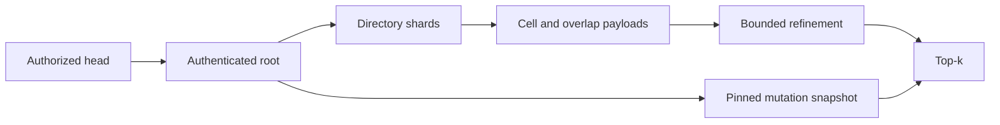

# Research consultation: completed, pending experimental validation

Consultation `56d471ee829f478c`, completed exit 0. Fable and Opus authentication failed; the configured GPT-6.1-Sol fallback produced this report. Recommendations and arithmetic below are research hypotheses, not qualified product capabilities or newly measured results. Root independently confirmed the full-cell nomination restriction and Fresh1m maintenance refusal in current source. The frozen paired100k protocol remains unchanged.

**Recommended next decision:** make immutable semantic cells the storage and maintenance unit, with a small hierarchical router and a bounded fetch schedule. Establish selected-cell coverage using the unchanged SQ8 scorer first. Treat overlap hyperedges and TurboQuant/RaBitQ as separate, measurable improvements.

The evidence supports this direction. It does **not** establish a universal best layout, 100M feasibility, or a vendor win.

This is read-only research against `1b06849a41caa6cccde75813d5847d8eb596c0a7`. I launched no jobs, reviews, children, native execution, or corpus evaluation.

**What the repository establishes**

| Evidence | Established result | Limit |
|---|---|---|
| Current CoHere FIRST1M, D768 cosine, sealed64, offered8 | Recall@10 **96.71875%**; retained offline recall@100 **93.796875%**; cold p90/p95 **541.095/557.409 ms**; completed QPS **7.597**; peak **205,119,488 B** | Consumed panel; no matched competitor result |
| Query traffic across64 | **8,261 GETs / 2,393,364,520 B**: averages **129.08 GETs / 35.66 MiB per query** | Payload accounting does not establish billing or retry overhead |
| Historical V282, 100k k100 | ReLAION graph/flat: **97.984375%/98.296875%**, p05 hits94/95. CoHere: **96.25%/96.046875%**, p05 hits92/90 | Historical quality reference; “flat” means flat centroid routing, not exhaustive SQ8 |
| Hierarchical prototype qualification | Exact401 source identity and six gates passed | Compilation and correctness evidence; **no corpus result** |
| Current hierarchical layout | Resident binary directory; primary8 plus independent boundary24; max32 whole512-row cells; unchanged SQ2/SQ8 | Local serial reads; no measured parallel S3 behavior or 100M lifecycle |
| Reorder-only replay | Preserving old closures increased aggregate payload from **2.393 GB to4.811 GB** and retained scientific **FAIL** | Rejects that specific closure-preserving reorder |

These are recorded in the [architecture decision](/home/rb/worktrees/borsuk-prod-ready-v9/docs/research/performance-architecture-20260930/semantic-1m/fixed48/architecture-decision-20261002/decision.md), [critical-path evidence](/home/rb/worktrees/borsuk-prod-ready-v9/docs/research/performance-architecture-20260930/semantic-1m/fixed48/architecture-decision-20261002/critical-path-evidence.json), [V282 reference](/home/rb/worktrees/borsuk-prod-ready-v9/docs/research/sequential-centroid-diversity-20260928/v282-reference/development64-reference.json), and [qualification receipt](/home/rb/worktrees/borsuk-prod-ready-v9/docs/research/performance-architecture-20260930/semantic-1m/hierarchical-cells/implementation-gates/a0002/integration-verification.json).

Fable `72453a13276b4bba` correctly identified the old eager router/startup problem and proposed paging. Its latency estimates concern an earlier revision. Sol `fd83927adff84314` identified a genuine transport tradeoff: fewer SOURCE GETs require more bridged bytes. Neither result demonstrates hierarchical-cell recall.

**Primary-source evidence, checked October3,2026**

| Source and date | Useful mechanism | Conditions and interpretation |
|---|---|---|
| [TurboQuant, April28,2025, §§3.1–3.2,4.4](https://arxiv.org/html/2504.19874v1) | Random rotation, nonuniform scalar quantization; residual QJL for unbiased inner-product estimation | ANN experiments use100k sampled vectors, DBpedia D1536/3072 and GloVe D200. **1@k** measures whether the exact nearest neighbor appears among approximate top-k; it is not recall@100. |
| [RaBitQ, May21,2024, §§3–5](https://arxiv.org/html/2405.12497v1) | Binary codes, per-vector correction factors, distance-error bounds and refinement | Original evaluation is in-memory IVF, including k100. Bounds concern scored vectors; they do not certify partition coverage. |
| [RaBitQ/TurboQuant comparison, v2 April30,2026, §§2,4.2–4.3](https://arxiv.org/html/2604.19528v2) | Explicit variant, hardware and rotation comparisons | RaBitQ authors report stronger results and reproducibility discrepancies under their tested settings. This is a substantive countercheck, not an independent universal verdict. |
| [SPANN, November5,2021, §3.2 and§4](https://arxiv.org/html/2111.08566v1) | Balanced postings, boundary expansion, query-aware pruning | Billion-scale SSD experiments; reported2× improvement concerns matched90% recall. Its hardware and quality conditions differ from cold S3 D768 k100. |
| [SPFresh, SOSP2023; arXiv October18,2024, §§3.3–4.4,5.1](https://arxiv.org/html/2410.14452v1) | Local split/merge/reassignment, versions, recovery | Azure local NVMe,16vCPU/128GB; billion-scale D128/D100 byte-vector datasets. Its raw-SSD append mechanism needs an immutable-object adaptation for S3. |
| [Turbopuffer ANNv3, updated May5,2026](https://turbopuffer.com/blog/ann-v3) | Hierarchical SPFresh-derived routing, RaBitQ, locality and refinement | The100B/D1024 result sizes deployments to cache the entire tree on SSD and uses distributed machines. It is not a cold-object-store measurement. |
| [Starling, v3 March2,2024, §§4–6.1](https://arxiv.org/html/2401.02116v3) | Reordered graph blocks, block search, navigation in memory | NVMe/O_DIRECT,2GB-memory/10GB-disk segments; separate build and serving machines. The43.9× result concerns range search at matched average precision. |
| [Hypergraph Embedding Index, August24,2026, §§3,5.2,6–7](https://arxiv.org/html/2608.22980v1) | Coordinate-combination postings and complementary positive/negative views | QQP/STS-B, D384, relevant-pair **Hit@10/Gold Recall**. These metrics do not establish exact ANN recall@100 or object-store scalability. |

TurboQuant’s current OpenReview PDF returned a browser challenge. The technical analysis above uses its accessible arXiv v1; [Google’s March24,2026 article](https://research.google/blog/turboquant-redefining-ai-efficiency-with-extreme-compression/) confirms the subsequent ICLR2026 presentation context. Its H100 attention-kernel results do not establish Rust CPU or S3 speedups.

The published **444 ms cold p90** reference is still shown for1M/D768 in [Turbopuffer’s March5,2026 article](https://turbopuffer.com/blog/turbopuffer). Corpus, recall, region and protocol remain unmatched. [AWS’s query documentation](https://docs.aws.amazon.com/AmazonS3/latest/userguide/s3-vectors-query.html) describes subsecond cold responses and90%+ average recall for most datasets without supplying a matched percentile benchmark.

**ELI5 mechanism**

Think of the vectors as books. The router chooses shelves; a cell holds nearby books together. Boundary overlap puts a few difficult books within reach from several nearby shelves. Quantization makes each book’s description smaller and faster to compare. Refinement checks promising descriptions more accurately.

Choosing the wrong shelves loses books before comparison begins. Better compression cannot recover them.

Let \(G\) be exact truth, \(C\) the fetched-cell population, \(M\) the nominated population, and \(R\) the returned results. The additive loss partition is:

\[
G\setminus C,\qquad (G\cap C)\setminus M,\qquad (G\cap M)\setminus R.
\]

Primary-router misses overlap subsequent boundary recovery. Final-ranking misses alone do not prove quantization causality; that requires comparing original-f32 and SQ8 scores on the **same admitted rows**. The current [loss decomposition](/home/rb/worktrees/borsuk-prod-ready-v9/crates/borsuk/src/hierarchical_semantic_cells.rs:1584) correctly distinguishes these populations.

TurboQuant and RaBitQ address scoring error. Small average error or unbiased estimates still allow reordered neighbors when the score gap around rank100 is tiny. Refinement and sufficient candidate coverage remain necessary.

The current [two-bit codec](/home/rb/worktrees/borsuk-prod-ready-v9/crates/borsuk/src/rotated_two_bit.rs:69) uses three256-coordinate signed Hadamard blocks at D768 and fitted scalar levels. A TurboQuant or RaBitQ implementation needs its own estimator, scalar metadata, rotation definition and format marker. Paper guarantees cannot automatically be attached to the existing codec.

I would prioritize **RaBitQ as the first alternative to compare**, while keeping TurboQuant eligible at equal total bytes. RaBitQ’s [official library](https://github.com/VectorDB-NTU/RaBitQ-Library) supplies useful multi-bit and CPU implementation references; a self-contained Rust implementation still needs independent qualification.

**Two concrete layouts**

1. **Compact resident hierarchy → whole SQ8 cells.** This is the simplest useful baseline.

   Store bounded semantic cells in immutable packs. Each cell has a complete authenticated extent, logical IDs and SQ8 rows. Store the hierarchy in compact binary arrays; initially retain existing centroid arithmetic for diagnostic comparisons, then qualify compressed centroid summaries separately.

   After routing, fetch selected cells in parallel and score every fetched SQ8 row. The current WholeCell path already downloads all their SQ8 bytes, but [ranks only SQ2-nominated blocks](/home/rb/worktrees/borsuk-prod-ready-v9/crates/borsuk/src/hierarchical_semantic_cells.rs:1420). Full-cell scoring therefore offers a direct way to examine wasted fetched coverage. Its additional CPU cost must be measured.

   A subsequent SQ8-only format removes redundant SQ2 query payload. Keep canonical originals in a separate maintenance tier.

   **DAG:** admitted router → selected whole cells → local ranking.  
   **Maximum dependency stages:** one payload stage after admission; three from an uncached head if head and router bundle require separate reads.

2. **Small resident root → directory shards → compressed cells and overlap blocks → bounded refinement.** This is the stronger long-term cold-storage candidate.

   Group approximately128 leaf summaries per authenticated directory shard. A small root contains summaries and hashes for those shards. Selected shards expose all candidate cell and overlap-block locations before payload fetching begins.

   The proposed overlap structure is a **true semantic hypergraph**: vertices are cells, and a hyperedge joins three or more geometrically adjacent cells. A bounded bridge block contains rows near their shared boundary, discovered using source geometry alone. It is indexed from incident directory entries and fetched directly. This is an invention proposal; the HEI paper does not validate it.

   Start with ordinary SQ8 cell payloads. Later, compare packed2–4-bit payloads plus cell-local32-row refinement blocks. Admit a hard budget for bridge copies, incidence metadata and refinement. References alone provide no extra coverage until their rows are fetched.

   **DAG:** root → directory shards → selected cell/bridge payloads → refinement → ranking.  
   **Maximum dependency stages:** three after root admission, or five from an uncached head. A direct whole-SQ8 variant uses two after admission.

These are dependency stages, not promised network roundtrips. With \(g\) available request slots, a stage containing \(J\) requests needs approximately \(\lceil J/g\rceil\) scheduling batches. Concurrent queries share those slots.

S3 supports one byte range per GET, so disjoint refinement blocks remain separate requests unless fetching intervening bytes. [AWS GetObject documentation](https://docs.aws.amazon.com/AmazonS3/latest/API/API_GetObject.html).

**100M formulas and new prospective envelopes**

The following is **design arithmetic**, before serialization overhead, allocator/runtime costs, retries, nonempty mutation startup and empirical quality.

Let \(N\) be rows, \(D=768\), maximum cell size \(S=512\), average occupancy fraction \(u\), selected payload blocks \(P\), directory group size \(F=128\), and:

\[
C\simeq\frac{N}{uS},\qquad q_b=\frac{Db}{8}+h_b.
\]

For illustration, \(h_b=16\) bytes covers an ID and two scalars; additional version fields must be charged if the chosen format needs them.

At100M, \(C\) is approximately195,313 at full occupancy,390,625 at half occupancy.

| Projected component | Formula | 100M consequence |
|---|---|---|
| Current binary f32 prototypes | \(2(C-1)D4\) | **1.20GB minimum**, or2.40GB at half occupancy, before parsed structures |
| Proposed resident wide hierarchy,2-bit summaries plus64B descriptors | \(\approx C\frac{F}{F-1}(192+64)\) | About**50.4–100.8MB** for full-to-half occupancy |
| Proposed paged root | \(\lceil C/F\rceil(192+64)\) | About**0.39–0.78MB**, plus root metadata |
|3-bit row payload | \(N(288+16)\) | **30.4GB** |
| Current combined cell payload | \(N(208+780)\) | **98.8GB** |
| Canonical f32 maintenance tier | \(N(8+4D)\) | **308GB**, separately charged |
| Overlap copies | \((\rho-1)Nq_b\) | Explicit storage/build/update amplification |
| Uncompressed ID→location records | \(Nw_{\mathrm{id}}\) |24B records imply2.4GB; keep the map paged |

The existing builder also admits a \(96N\)-byte payload term: **9.6GB at100M**. Its100k qualification does not establish a streaming100M builder. See [build admission](/home/rb/worktrees/borsuk-prod-ready-v9/crates/borsuk/src/hierarchical_semantic_cells.rs:457).

I propose these **new example Pareto envelopes** for a future protocol:

| Profile | Selected blocks \(P\) | Whole SQ8: GETs / row bytes | Compressed variant: GETs / row bytes* | Prospective quality target |
|---|---:|---:|---:|---|
| Lean |16 |16 /6.09MiB |40 /3.01MiB | Mean R10/R100≥95%; report lower tail |
| Balanced |32 |32 /12.19MiB |72 /5.76MiB | Mean R10/R100≥97%; report lower tail |
| Higher quality |64 |64 /24.38MiB |136 /11.27MiB | Mean R10/R100≥98%; p05@100≥95 |

\*Assumes eight directory reads of128 summaries,3-bit304B rows, and at most \(P\) refinement reads of32SQ8 rows:

\[
G=8+P+P,\qquad
B=8(128)(256)+PS(304)+P(32)(780).
\]

Headers, authentication and overlap-incidence metadata need explicit reserves before freezing actual caps. Cold head/root reads add two GETs under the stated empty/already-admitted-delta assumption.

These targets create comparable prospective resource/quality points. They do not turn historical failures into passes. Keep the pending100k arm’s **32GET/16MiB/.98/p05≥95** contract intact. A vendor comparison additionally requires matched conditions and equal-or-better measured recall.

For memory, use:

\[
M_{\mathrm{peak}}=
M_{\mathrm{unique\ pinned\ routers}}
+M_{\mathrm{cache}}
+Q_{\max}M_{\mathrm{query}}
+M_{\mathrm{delta}}
+M_{\mathrm{maintenance}}
+M_{\mathrm{runtime}}.
\]

A starting100M resource hypothesis is four active queries,64MiB/query allowance, bounded64MiB cache,128MiB mutation allowance,256MiB maintenance allowance, and separately charged old/new routers. An approximately2GiB process/cgroup envelope is a **prospective admission target**, not feasibility evidence. Higher-memory Pareto points remain legitimate.

**Mutation, publication, pins and maintenance**

One Rust runtime should own query admission, cache, mutation state and a bounded in-process maintenance worker. Reuse the existing conditional-head and authenticated-snapshot foundations; change their persistent layout as necessary.

- **Insert/update/delete:** persist a bounded latest-state delta. Pending upserts hide old base copies and are scored alongside base candidates. Deletes hide every replica. Cap exhaustion backpressures writes or invokes compaction.
- **Locate affected cells:** maintain a paged authenticated ID→owner/version map. Cell-local maintenance otherwise requires an expensive base scan.
- **Compact:** read only a bounded set of affected canonical cells and incident overlap blocks; rewrite their packs and directory paths. Never re-encode repeatedly from lossy reconstructions when original-vector fidelity is required.
- **Publish:** upload immutable bodies and authentication metadata first, then CAS a head binding the base root and mutation revision. Keep codec identity and version markers within that authority.
- **Pins:** a query retains one coherent base/delta view. Charge unique shared pages once and private scratch per query. Bound retained generations; delay publication when slow readers would exceed admission.
- **Restart:** recover the bounded journal and immutable ready checkpoint. Resolve uncertain CAS outcomes by reading the head. Unpublished uploads remain orphans.
- **GC:** reclaim a pack only when no live root, pin or maintenance checkpoint references any extent. Preserve bounded progress across passes; repeatedly scanning the same retained prefix can starve collection.
- **Coordination:** enforce the current single-host/shared-coordinator contract initially. Multi-host reader reclamation requires a durable fenced pin/lease protocol and its additional operations.

S3 [conditional writes](https://docs.aws.amazon.com/AmazonS3/latest/userguide/conditional-writes.html) and [strong consistency](https://docs.aws.amazon.com/AmazonS3/latest/userguide/Welcome.html) support head publication. Reader lifetime protection remains a separate responsibility.

The current code provides bounded mutation snapshots, query semaphores and in-process compaction. Its lifecycle locks protect cooperating users on one host/shared filesystem, and [Fresh1m compaction is explicitly rejected](/home/rb/worktrees/borsuk-prod-ready-v9/crates/borsuk/src/two_bit_compaction.rs:390). That is material unfinished product work.

**Strongest counterexamples**

1. **Diffuse geometry defeats fixed beams.** Early pruning can discard an entire relevant subtree. Bottom-level overlap cannot repair it unless an incident repair block remains reachable. SPANN’s Figure2 illustrates the tail: on SIFT1M,80% of queries needed six postings for nearest-neighbor coverage, while99% needed114. [SPANN §3.1](https://arxiv.org/html/2111.08566v1).

2. **Centroids can conceal useful populations.** Averages of mixed or elongated clusters are weak representatives. The earlier [V149 failure](/home/rb/worktrees/borsuk-prod-ready-v9/docs/research/v149-contiguous-hierarchy-closeout.md) demonstrates a concrete instance. Semantic regrouping supplies a different mechanism, but still needs measured coverage.

3. **Near ties require expensive refinement.** Quantizer confidence intervals can overlap for many candidates. A fixed refinement cap preserves resource bounds without supplying unconditional exact top-k guarantees.

4. **HEI postings can overwhelm the layout.** With its evaluated \(t=10,r=3\), two views produce \(2\binom{10}{3}=240\) memberships/document. At100M, uncompressed8B IDs alone imply192GB. Compression can reduce this, but candidate coverage and coordinate dependence remain separate concerns. A cosine-preserving rotation can change its coordinate keys. [HEI §§3,5.2](https://arxiv.org/html/2608.22980v1).

5. **Small cells amplify scattered updates.** Under uniform independent updates, the expected touched fraction is:
   \[
   1-(1-1/C)^m.
   \]
   Changing1M rows—1% of100M—touches about**99.4%** of full512-row cells, or92.3% at half occupancy. This is a probabilistic model, but it exposes why “local compaction” need not mean low total write cost.

6. **Graphs remain attractive under different storage conditions.** Starling’s block-locality ideas are useful inside already fetched payloads or a bounded SSD cache. A global cold-S3 traversal introduces dependent fetch decisions. I would first measure flat scans of512-row cells before adding local graph storage/build cost.

Maintenance cost must therefore include uploaded bytes, PUT/GETs, build CPU, GC scans, scratch and retained generations—not just query traffic.

**One decisive cheapest no-cloud falsifier**

After the existing paired100k worker closes its terminal artifacts, perform **one authenticated coverage-ceiling audit of its frozen consumed64 traces**, with no ANN rerun or routing sweep.

For each ReLAION and CoHere query, intersect its frozen `covered_ids`, `nominated_ids` and returned IDs with exact truth. Use the declared primary8/boundary24/max32 policy unchanged.

\[
R_{\mathrm{ceiling}}(q)=\frac{|G_q\cap C_q|}{100}.
\]

This requires small roster/truth reads and set intersections; it needs no new quantizer, cloud instance or corpus-wide scoring.

Predeclare the interpretation:

- Ceiling mean<.98 or p05 hits<95: this frozen arm cannot pass its original quality gate, even with perfect scoring.
- Ceiling also below the proposed95% class: its selection policy cannot support the lowest proposed class on this diagnostic.
- Ceiling adequate but nomination poor: prioritize a separate full-fetched-SQ8 scoring arm.
- Nomination adequate but returned quality poor: compare f32/SQ8 on identical nominees before attributing loss to quantization.

Freeze this audit’s rule before truth inspection. Use no truth-selected cells or tuned beams. A favorable consumed-panel ceiling permits a fresh qualification experiment; it does not establish production recall.

**Where10× might occur—and the hard limits**

Tenfold improvement is plausible for selected components:

- Router metadata can shrink by over an order of magnitude through a compact representation and wider hierarchy.
- Query bytes could fall approximately10× if a small selected population can be searched with low-bit codes and little refinement.
- Small updates could avoid whole-generation rebuilding when changes are concentrated.

None is a measured end-to-end10× gain.

Keeping a full SQ8 tier while replacing2-bit codes with3-bit codes increases combined row bytes from988 to1084. Compression pays when it removes a tier, reduces fetched populations, or avoids refinement.

The current closed CPU counterfactual is decisive: halving **all POST CPU** yields conditional p90 **472.595ms**; erasing it yields **405.750ms**, about1.33× improvement. These are optimistic counterfactuals, not SIMD results.

Mean POST CPU is131.094ms/query. At that work level, two cores permit at most approximately15.26QPS before other costs; whole-process CPU gives approximately11.04QPS. Achieving ten times the current throughput needs much less work per query, more compute, or both.

Cold latency follows the actual dependency path:

\[
T_{\mathrm{cold}}
\approx T_{\mathrm{connection/pin}}
+\sum_{\mathrm{dependent\ stages}}T_{\mathrm{stage}}
+T_{\mathrm{unhidden\ CPU}}.
\]

Fewer GETs do not automatically mean fewer stages or lower latency. Transfer, hashing, scheduling and queueing must be measured together.

**My architectural choice is the paged hierarchy and immutable cell-pack direction, initially using unchanged SQ8 scoring.** The resident alternative provides a useful simpler comparison. Add bounded overlap only where source geometry yields enough coverage benefit to justify its replication and mutation cost. Compare TurboQuant and RaBitQ after coverage is established, with equal total bytes and explicit refinement accounting.

The unresolved decisions are real-cell coverage, compressed-router error, necessary overlap, refinement amplification, concurrent CPU,100M build resources, mutation locality, pin/reclamation coordination and lifecycle dollars.

During research, the preserved staging work advanced the shared checkout to `fcd0020d` and created an untracked canary directory. Rust crate sources did not change relative to the requested revision. I left that work untouched and notified the operator that this research was complete.
