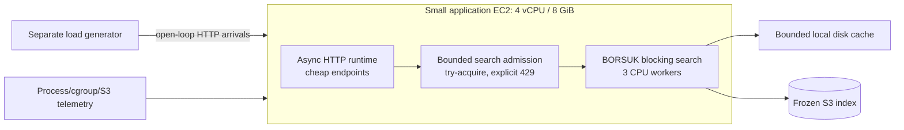

# REST Workload Isolation Benchmark

## Goal

Prove that a small application process can embed BORSUK, serve vector search
from a much larger S3-backed index, and preserve the latency of ordinary REST
endpoints while vector traffic consumes CPU and object-store bandwidth.

This is a release gate, not a peak-throughput demo. A run is invalid unless it
uses a frozen source revision, immutable index receipt, separate load-generator
machine, open-loop arrivals, exact-oracle recall, and terminal AWS receipts.

## Architecture

The server and BORSUK run in the same process. The async HTTP runtime never
executes vector search directly: accepted search requests enter a bounded
blocking path, while overload is returned as HTTP 429 instead of creating an
unbounded queue. `BORSUK_CPU_THREADS=3` reserves scheduling capacity on the
four-vCPU server for HTTP, metrics, and kernel work. BORSUK's own
`OpenOptions::max_concurrent_searches` remains enabled as a second, library-side
memory and decode admission bound.

The load generator runs on a separate instance and schedules requests against
absolute monotonic deadlines. A late request is still emitted and its queueing
delay remains in latency, preventing coordinated-omission bias.

## Endpoints

- `GET /health`: static JSON and no BORSUK work. This is the scheduler-isolation
  canary.
- `GET /api/item/:id`: deterministic JSON serialization plus a small in-memory
  lookup. This represents ordinary application work without vector CPU.
- `POST /api/search`: a real floating-point query vector and `k=10`; response
  includes IDs, distances, execution engine, pages, bytes, and elapsed time.
- `GET /metrics`: cumulative accepted/rejected/in-flight search counts and
  cheap/search request totals. The load generator records latency separately.

## Frozen phases

Each phase has a warm-up that is excluded from results, a fixed measurement
duration, and three repetitions. Phase order rotates by repetition.

1. **Cheap baseline:** only `/health` and `/api/item`; establishes normal p95
   and p99.
2. **Search-only staircase:** raise open-loop vector QPS until 429 or the vector
   p99 gate fails. This finds sustainable capacity rather than hiding overload
   in a client concurrency limit.
3. **Mixed normal:** 80% cheap, 20% vector at 70% of sustainable vector QPS.
4. **Mixed overload:** cheap traffic stays fixed while offered vector load is
   150% of sustainable capacity. Cheap endpoints must remain healthy and vector
   overload must appear as bounded 429 responses.
5. **Lifecycle coexistence (after read MVP passes):** repeat mixed normal while
   a bounded update/delete/flush/compaction schedule runs in the same process.

SIFT-1M is the first diagnostic because it has an exact public oracle. Frozen
publication datasets then cover realistic dimensions and scale, including the
100M case, without changing this workload contract.

## Release acceptance gates

All gates apply independently to every completed repetition:

- vector recall@10 is at least `0.95` against the exact frozen oracle;
- vector execution engine is always `bounded-cell-card-v15`;
- mixed-normal cheap p99 is at most `max(baseline_p99 * 1.25,
  baseline_p99 + 2 ms)` and cheap error rate is below `0.1%`;
- mixed-overload cheap p99 is at most `max(baseline_p99 * 1.50,
  baseline_p99 + 5 ms)` and cheap error rate is below `0.1%`;
- vector overload uses HTTP 429; no accepted request is silently dropped and no
  unbounded server queue is permitted;
- no OOM, cgroup memory event, swap use, sustained memory PSI, or process
  restart occurs;
- cache footprint never exceeds its configured byte cap;
- every result records accepted/offered QPS, p50/p95/p99/max, errors, 429s,
  recall, CPU, RSS, cgroup memory, PSI, cache bytes, and S3 requests/bytes.

The p99 gates are intentionally relative to the colocated cheap baseline: this
measures application interference rather than rewarding a generally slow
server.

## AWS and evidence contract

- Server: Graviton `c7g.xlarge` (4 vCPU, 8 GiB), Spot by default, no swap,
  2 GiB BORSUK resident budget, 1 GiB disk cache, three BORSUK CPU workers.
- Generator: separate Spot instance in the same region/AZ; it must remain below
  50% CPU and report its own scheduling-lag histogram.
- The server uses the frozen S3 index directly; it does not copy the full index
  to local disk or create a single replacement artifact.
- Every attempt uploads config, source/binary hashes, instance identities,
  cgroup/cache attestation, raw samples, summaries, and exactly one terminal
  marker. Interrupted cells upload partial diagnostics but are discarded and
  restarted.
- Compute is terminated immediately after the terminal marker. Incomplete CSVs
  are not inspected.

## Implementation slices

1. Add the same-process REST server and deterministic local smoke test.
2. Add the open-loop load generator, summary validator, and synthetic local
   isolation test that must observe explicit 429 under overload.
3. Add Publication V3 workload identity, AWS launcher, runtime attestation, and
   terminal receipt validation.
4. Run SIFT smoke, correct recall or isolation regressions, then freeze and run
   three full repetitions.
5. Extend the unchanged method to the realistic-dimension and 100M datasets,
   then publish only validated frozen results in README/docs/web.
